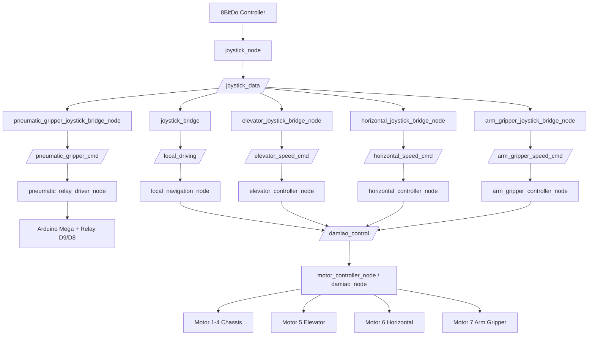
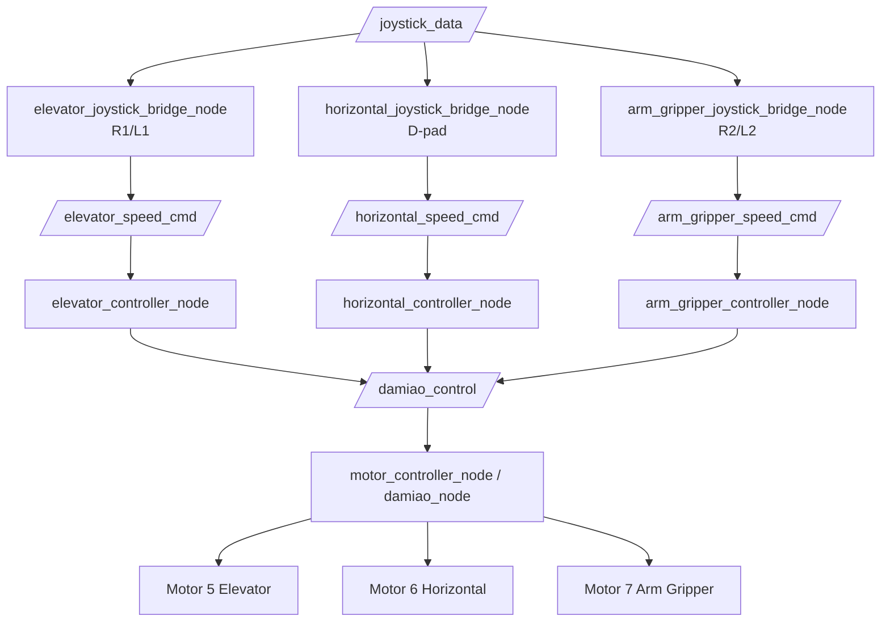
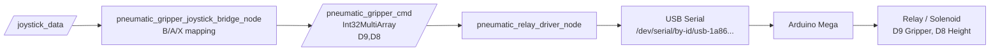
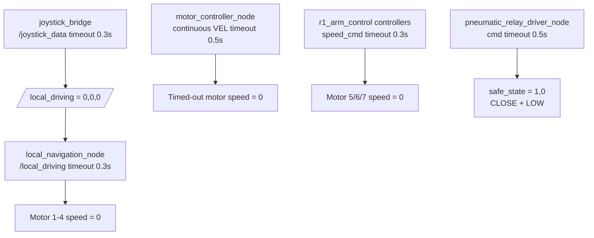
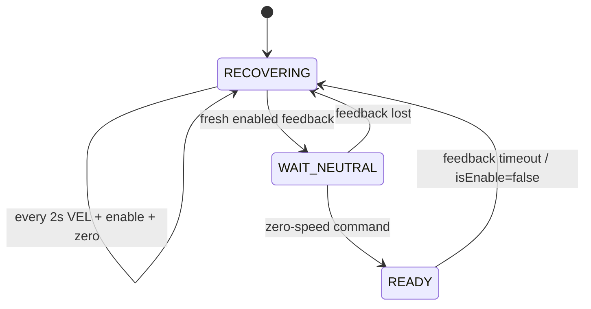

> 2026-06-19 現行操作入口：目前手柄鍵位、STAFF/KFS mode、D-pad 視角、五路 relay 順序請先看 [`CONTROLLER_USAGE.md`](CONTROLLER_USAGE.md)。本文若是舊測試/排查紀錄，內容保留作歷史，不代表目前實機鍵位。

> 2026-06-19 現行操作準則：手柄鍵位、STAFF/KFS mode、D-pad 視角與五路 relay 順序以 [`CONTROLLER_USAGE.md`](CONTROLLER_USAGE.md) 為唯一準則。本文件較早日期的鍵位段落保留為歷史紀錄，不作為目前實機操作依據。

# R1 ROS 2 System Architecture

本文记录当前 R1 工作区的整体架构、node/topic 数据流和各 package 职责。

## 1. Workspace Overview

```text
r1_control_ws/
  src/
    my_joystick_msgs
    my_joystick_driver
    joystick_bridge
    base_omniwheel_r2_700
    r1_arm_control
    arduino_pneumatic_driver
    keyboard_teleop
```

当前 R1 系统由三条主要控制链组成：

```text
1. 底盘控制链
2. Motor 5/6/7 机械臂执行机构控制链
3. Arduino pneumatic gripper 控制链
```

另外有一条可选键盘调试链：

```text
keyboard_teleop -> existing command topics
```

## 2. Architecture Graphs

### Full System Overview



### Base Chassis Chain

```mermaid
flowchart LR
    Controller[8BitDo Controller]
    JoyNode[joystick_node]
    JoyTopic[/joystick_data<br/>Joystick msg<br/>-512..512/]
    Bridge[joystick_bridge]
    LocalDriving[/local_driving<br/>Float32MultiArray<br/>direction, speed_cm_s, rotation/]
    Nav[local_navigation_node]
    DamiaoCmd[/damiao_control<br/>motor_id, mode, speed_rad_s, duration/]
    Driver[motor_controller_node<br/>damiao_node.py]
    CAN[USB-CAN]
    Motors[Motor 1-4<br/>Omni Chassis]

    Controller --> JoyNode --> JoyTopic --> Bridge --> LocalDriving --> Nav --> DamiaoCmd --> Driver --> CAN --> Motors
```



### Arm Motor Chain



### Pneumatic Gripper Chain



### Safety Watchdog Chain



## 3. Full Controller Runtime

当前推荐启动脚本：

```bash
./r1_start_base_1_0.sh
```

该脚本启动 tmux session：

```text
r1_control
```

tmux 窗口：

```text
0 joystick      my_joystick_driver/joystick_node
1 base_bridge   joystick_bridge/joystick_bridge
2 motors        base_omniwheel_r2_700/damiao_node
3 nav           base_omniwheel_r2_700/local_navigation_node
4 elevator      r1_arm_control/elevator_controller_node
5 elev_bridge   r1_arm_control/elevator_joystick_bridge_node
6 horizontal    r1_arm_control/horizontal_controller_node
7 horiz_bridge  r1_arm_control/horizontal_joystick_bridge_node
8 gripper       r1_arm_control/arm_gripper_controller_node
9 grip_bridge   r1_arm_control/arm_gripper_joystick_bridge_node
10 pneumatic    arduino_pneumatic_driver/pneumatic_relay_driver_node
11 pneu_bridge  arduino_pneumatic_driver/pneumatic_gripper_joystick_bridge_node
12 monitor      ROS monitor shell
```

## 4. Joystick Input Layer

Package:

```text
src/my_joystick_driver
```

Node:

```text
/joystick_node
```

Hardware input:

```text
8BitDo controller
Linux evdev
/dev/input/event*
```

Published topic:

```text
/joystick_data
type: my_joystick_msgs/msg/Joystick
rate: 20 Hz
```

Current message range:

```text
lx/ly/rx/ry: -512 .. 512
dx/dy: -512, 0, 512
l2/r2: 0 .. 512
buttons: bool
```

Custom message package:

```text
src/my_joystick_msgs
```

Message:

```text
my_joystick_msgs/msg/Joystick
```

## 5. Base Chassis Control Chain

Packages:

```text
src/joystick_bridge
src/base_omniwheel_r2_700
```

Data flow:

```text
8BitDo controller
  -> /joystick_node
  -> /joystick_data
  -> /joystick_bridge
  -> /local_driving
  -> /local_navigation_node
  -> /damiao_control
  -> /motor_controller_node
  -> USB-CAN
  -> DM Motor 1-4
```

Detailed flow:

```text
/joystick_node
  publishes /joystick_data
    type: my_joystick_msgs/msg/Joystick

/joystick_bridge
  subscribes /joystick_data
  converts left/right stick to chassis command
  publishes /local_driving
    type: std_msgs/msg/Float32MultiArray
    data = [direction_rad, speed_cm_per_sec, rotation_rad_per_sec]

/local_navigation_node
  subscribes /local_driving
  computes four-wheel omni inverse kinematics
  publishes /damiao_control
    type: std_msgs/msg/Float32MultiArray
    data = [motor_id, mode, speed_rad_s, duration]

/motor_controller_node
  implemented by damiao_node.py
  subscribes /damiao_control
  sends velocity commands through USB-CAN
  controls Motor 1-4 for chassis
```

Base motor mapping:

```text
Motor 1 = left front
Motor 2 = right front
Motor 3 = right rear
Motor 4 = left rear
```

Current base kinematics defaults:

```text
lateral_axis_sign = 1.0
rotation_axis_sign = 1.0
forward_coeff_1..4 = [1, 1, -1, -1]
lateral_coeff_1..4 = [1, -1, -1, 1]
rotation_coeff_1..4 = [1, -1, 1, -1]
motor_direction_1..4 = [-1, 1, -1, 1]
```

## 6. Arm Actuator Control Chain

Package:

```text
src/r1_arm_control
```

Controlled actuators:

```text
Motor 5 = elevator
Motor 6 = horizontal movement
Motor 7 = arm gripper motor
```

### Motor 5 Elevator

Data flow:

```text
/joystick_data
  -> /elevator_joystick_bridge_node
  -> /elevator_speed_cmd
  -> /elevator_controller_node
  -> /damiao_control
  -> /motor_controller_node
  -> Motor 5
```

Topics:

```text
/elevator_speed_cmd
type: std_msgs/msg/Float32MultiArray
data = [speed_rad_s]

/elevator_status
type: std_msgs/msg/Float32MultiArray
data = [target_speed, commanded_speed, timeout_active, motor_id]
```

Control mapping:

```text
R1: positive elevator fixed speed
L1: negative elevator fixed speed
R1 + L1: stop
```

### Motor 6 Horizontal

Data flow:

```text
/joystick_data
  -> /horizontal_joystick_bridge_node
  -> /horizontal_speed_cmd
  -> /horizontal_controller_node
  -> /damiao_control
  -> /motor_controller_node
  -> Motor 6
```

Topics:

```text
/horizontal_speed_cmd
type: std_msgs/msg/Float32MultiArray
data = [speed_rad_s]

/horizontal_status
type: std_msgs/msg/Float32MultiArray
data = [target_speed, commanded_speed, timeout_active, motor_id]
```

Control mapping:

```text
D-pad left/right: horizontal movement
D-pad up/down: power level 0.2 / 0.5 / 1.0
```

### Motor 7 Arm Gripper Motor

Data flow:

```text
/joystick_data
  -> /arm_gripper_joystick_bridge_node
  -> /arm_gripper_speed_cmd
  -> /arm_gripper_controller_node
  -> /damiao_control
  -> /motor_controller_node
  -> Motor 7
```

Topics:

```text
/arm_gripper_speed_cmd
type: std_msgs/msg/Float32MultiArray
data = [speed_rad_s]

/arm_gripper_status
type: std_msgs/msg/Float32MultiArray
data = [target_speed, commanded_speed, timeout_active, motor_id]
```

Control mapping:

```text
R2: positive gripper motor speed, analog
L2: negative gripper motor speed, analog
R2/L2 equal depth: stop
```

## 7. Pneumatic Gripper Control Chain

Package:

```text
src/arduino_pneumatic_driver
```

Hardware:

```text
Arduino Mega
USB Serial
2-channel relay / solenoid valve
```

Default serial port:

```text
/dev/serial/by-id/usb-1a86_USB2.0-Serial-if00-port0
```

Data flow:

```text
/joystick_data
  -> /pneumatic_gripper_joystick_bridge_node
  -> /pneumatic_gripper_cmd
  -> /pneumatic_relay_driver_node
  -> USB Serial
  -> Arduino
  -> Relay D9/D8
```

Topic:

```text
/pneumatic_gripper_cmd
type: std_msgs/msg/Int32MultiArray
data = [D9_gripper_state, D8_height_state]
```

Relay meaning:

```text
D9 gripper:
  0 = OPEN
  1 = CLOSE

D8 height:
  0 = LOW
  1 = HIGH
```

Control mapping:

```text
B: gripper OPEN while held, CLOSE when released
A: latch height HIGH
X: latch height LOW
```

Default safe state:

```text
[1, 0] = CLOSE + LOW
```

Status topic:

```text
/pneumatic_gripper_status
type: std_msgs/msg/String
```

## 8. Keyboard Teleop Debug Chain

Package:

```text
src/keyboard_teleop
```

Node:

```text
/keyboard_teleop_node
```

Purpose:

```text
Temporary low-speed debugging without a physical controller.
```

It publishes directly to existing command topics:

```text
/local_driving
/elevator_speed_cmd
/horizontal_speed_cmd
/arm_gripper_speed_cmd
/pneumatic_gripper_cmd
```

Important rule:

```text
Do not run keyboard_teleop together with joystick bridges.
```

Otherwise multiple input sources will publish to the same command topics.

## 9. Safety Architecture

### Joystick Bridge Watchdog

```text
/joystick_bridge
  watches /joystick_data
  if timeout > input_timeout_sec = 0.3 s
  publishes /local_driving = [0, 0, 0]
```

### Base Navigation Watchdog

```text
/local_navigation_node
  watches /local_driving
  if timeout > command_timeout_sec = 0.3 s
  publishes zero speed to Motor 1-4 through /damiao_control
```

### Damiao Motor Watchdog

```text
/motor_controller_node
  watches continuous VEL commands with duration = 0.0
  if motor command timeout > command_timeout_sec = 0.5 s
  sends 0 rad/s to the timed-out motor_id
```

### Arm Controllers Watchdog

```text
/elevator_controller_node
/horizontal_controller_node
/arm_gripper_controller_node
  watch their speed command topics
  if timeout > timeout_sec = 0.3 s
  publish 0 rad/s to /damiao_control
```

### Pneumatic Driver Watchdog

```text
/pneumatic_relay_driver_node
  watches /pneumatic_gripper_cmd
  if timeout > command_timeout_sec = 0.5 s
  sends safe_state = [1,0]
```

## 10. Topic Summary

| Topic | Type | Publisher | Subscriber |
|---|---|---|---|
| `/joystick_data` | `my_joystick_msgs/msg/Joystick` | `/joystick_node` | joystick bridges |
| `/local_driving` | `std_msgs/msg/Float32MultiArray` | `/joystick_bridge`, optional `/keyboard_teleop_node` | `/local_navigation_node` |
| `/damiao_control` | `std_msgs/msg/Float32MultiArray` | base/arm controllers | `/motor_controller_node` |
| `/elevator_speed_cmd` | `std_msgs/msg/Float32MultiArray` | `/elevator_joystick_bridge_node`, optional keyboard | `/elevator_controller_node` |
| `/horizontal_speed_cmd` | `std_msgs/msg/Float32MultiArray` | `/horizontal_joystick_bridge_node`, optional keyboard | `/horizontal_controller_node` |
| `/arm_gripper_speed_cmd` | `std_msgs/msg/Float32MultiArray` | `/arm_gripper_joystick_bridge_node`, optional keyboard | `/arm_gripper_controller_node` |
| `/pneumatic_gripper_cmd` | `std_msgs/msg/Int32MultiArray` | `/pneumatic_gripper_joystick_bridge_node`, optional keyboard | `/pneumatic_relay_driver_node` |
| `/elevator_status` | `std_msgs/msg/Float32MultiArray` | `/elevator_controller_node` | monitor |
| `/horizontal_status` | `std_msgs/msg/Float32MultiArray` | `/horizontal_controller_node` | monitor |
| `/arm_gripper_status` | `std_msgs/msg/Float32MultiArray` | `/arm_gripper_controller_node` | monitor |
| `/pneumatic_gripper_status` | `std_msgs/msg/String` | `/pneumatic_relay_driver_node` | monitor |

## 11. Current Important Defaults

```text
Joystick axis range: -512 .. 512
Joystick trigger range: 0 .. 512
Joystick deadzone: 15

joystick_bridge:
  max_speed_cm = 150.0
  translation_linear_weight = 0.1
  max_rotation = 1.2
  rotation_linear_weight = 0.1
  input_timeout_sec = 0.3

local_navigation_node:
  max_wheel_speed_rad_s = 64.0
  max_wheel_accel_rad_s2 = 12.0
  command_timeout_sec = 0.3
  omniwheel_radius_m = 0.0635

damiao_node / motor_controller_node:
  motor_ids = [1,2,3,4,5,6,7]
  command_timeout_sec = 0.5

arduino_pneumatic_driver:
  safe_state = [1,0]
  command_timeout_sec = 0.5
```

## ROS2 Domain Boundary

R1 control graph must run inside its own ROS2 domain:

```bash
ROS_DOMAIN_ID=1
ROS_LOCALHOST_ONLY=1
```

R2 should use a different domain, for example `ROS_DOMAIN_ID=2`. This prevents R1 from discovering R2-only nodes such as `/damiao_motor_controller` and topics such as `/base/dummy_control`. See `ROS_DOMAIN_ISOLATION.md`.

## 2026-06-06 Joystick Bridge 更新

左摇杆平移链路使用 `150 cm/s` 上限，右摇杆旋转链路使用 `1.2 rad/s` 上限；两者均采用 `0.1x + 0.9x³`。Motor 7 的 R2/L2 净输入同样采用该曲线，最大 `1.3 rad/s`。START/SELECT 不参与底盘调速，watchdog 接口不变。

## 2026-06-07 Damiao 急停恢复状态机



`RECOVERING` 和 `WAIT_NEUTRAL` 都只允许向硬件发送 `0 rad/s`。`/damiao_motor_status` 发布 Motor 1-7 的状态。


## 2026-06-15 人視角控制架構更新

目前底盤上層加入「操作人座標到車體座標」的離散轉換，仍保持節點解耦：

```text
/joystick_data
  -> joystick_bridge
       D-pad: 保存 E-stop 在人視角中的 0/90/180/270 度方向
       left stick: operator frame -> body frame
       right stick: rotation unchanged
  -> /local_driving
  -> local_navigation_node
```

`joystick_bridge` 另發布 `/view_orientation` (`std_msgs/msg/Int32`)：
`0=前、1=右、2=後、3=左`。視角切換預設要求左搖桿回中，沒有 IMU 自動修正。

Motor6 的輸入鏈改為：

```text
L3/R3 -> horizontal_joystick_bridge_node
      -> /horizontal_speed_cmd [-10/0/+10 rad/s]
      -> horizontal_controller_node
      -> Motor6 VEL
```

底層運動學、CAN driver、Motor6 controller、topic 類型與 watchdog 均未改變。本功能已於
2026-06-15 完成實機驗證。

## 2026-06-18 Current Runtime Architecture Override

This section records the current runtime architecture and supersedes older node graphs that still mention legacy arm gripper or two-channel pneumatic nodes.

Startup path:

```text
scripts/wait_and_start_robot.sh                  # optional boot watcher
  -> r1_start_base_1_0.sh                         # tmux runtime launcher
```

Current tmux runtime nodes:

```text
my_joystick_driver/joystick_node
joystick_bridge/joystick_bridge
base_omniwheel_r2_700/damiao_node
base_omniwheel_r2_700/local_navigation_node
r1_arm_control/elevator_controller_node
r1_arm_control/elevator_joystick_bridge_node
r1_arm_control/horizontal_controller_node
r1_arm_control/horizontal_joystick_bridge_node
r1_arm_control/motor7_position_controller_node
r1_arm_control/motor8_position_controller_node
r1_arm_control/motor_position_selector_joystick_bridge_node
kfs_staff_gripper/kfs_staff_gripper_arduino_node
arduino_pneumatic_driver/pneumatic_gripper_joystick_bridge_node
kfs_staff_gripper/kfs_staff_gripper_joystick_bridge_node
```

Current pneumatic aggregation:

```text
pneumatic_gripper_joystick_bridge_node -> /pneumatic_gripper_cmd
kfs_staff_gripper_joystick_bridge_node -> /kfs_staff_gripper_cmd
kfs_staff_gripper_arduino_node -> Arduino [KFS, M7 height, M7 gripper, M8 inclination, M8 height, M8 gripper, M7 inclination]
```

Do not launch the legacy `pneumatic_relay_driver_node` together with `kfs_staff_gripper_arduino_node`, because both would try to own the Arduino serial path.


## 2026-06-19 KFS gripper 視角基準更新

本節取代 2026-06-15 中「D-pad 保存 E-stop 方向」的現行架構描述。節點拆分不變，只有 `joystick_bridge` 的視角語義改變：

```text
/joystick_data
  -> joystick_bridge
       D-pad: 保存 KFS gripper 在人視角中的 0/90/180/270 度方向
       internal: E-stop/body-front view = (KFS view + 1) % 4
       left stick: operator frame -> body frame
       right stick: rotation unchanged
  -> /local_driving
  -> local_navigation_node
```

`/view_orientation` (`std_msgs/msg/Int32`) 現在發布 KFS gripper 方向，`0=前、1=右、2=後、3=左`。預設值為 `2`，對應 KFS gripper 開機朝向操作人。底層運動學、CAN driver、Motor6 controller、topic 類型與 watchdog 均未改變。


## 2026-06-19 KFS gripper 車頭標架構更新

本節取代同日 KFS `+1` 偏移方案。節點拆分不變，只有 `joystick_bridge` 的視角換算改為 KFS gripper 直接代表車體前方：

```text
/joystick_data
  -> joystick_bridge
       D-pad: 保存 KFS gripper／body-front 在人視角中的 0/90/180/270 度方向
       internal: body_front_view = KFS view
       left stick: operator frame -> body frame
       right stick: rotation unchanged
  -> /local_driving
  -> local_navigation_node
```

`/view_orientation` (`std_msgs/msg/Int32`) 發布 KFS gripper／車頭方向，`0=前、1=右、2=後、3=左`。預設值為 `2`。底層運動學、CAN driver、Motor6 controller、topic 類型與 watchdog 均未改變。


## 2026-06-19 KFS gripper 開機預設更新

`joystick_bridge` 的節點架構不變，但 `default_view_orientation` 預設由 `2` 改為 `0`。啟動時假設 KFS gripper／body-front 在操作人視角前方。

`/view_orientation` 啟動後應發布 `0`；KFS gripper 仍直接視為車體前方，內部仍使用 `body_front_view = KFS view`。


## 2026-06-19 KFS 車頭標 90 度校正架構更新

`joystick_bridge` 節點連線不變，但根據實機結果更新 operator-frame 到 body-frame 的校正公式：

```text
body_front_view = (KFS view - 1) % 4
```

`/view_orientation` 仍表示 KFS gripper／視覺車頭在人視角中的方向，啟動預設仍為 `0`。底層 `local_navigation_node`、CAN driver、topic 類型、速度限制與 watchdog 均未改變。


## 2026-06-19 STAFF/KFS operation mode architecture

新增 `operation_mode_control` package，負責把 SELECT/START 轉換為 `/operation_mode`：

```text
/joystick_data
  -> operation_mode_selector_node
  -> /operation_mode 0=INVALID, 1=STAFF, 2=KFS
```

下游 bridge 只透過 topic 解耦，不依賴 selector 內部實作：

```text
/operation_mode=1 STAFF
  -> motor_position_selector_joystick_bridge_node 接受 X/B/L2/R2
  -> pneumatic_gripper_joystick_bridge_node 接受 A/Y/R1/L1

/operation_mode=2 KFS
  -> kfs_staff_gripper_joystick_bridge_node 接受 Y
```

`joystick_bridge` 底盤控制不訂閱 `/operation_mode`，因此左搖桿、右搖桿、D-pad KFS 視角在所有 mode 中保持一致。

Timeout：`operation_mode_selector_node` 在 joystick timeout 後發布 `0`；各 mechanism bridge 在 mode timeout 或 joystick timeout 時忽略按鍵或回 safe state。


## 2026-06-19 KFS mode elevator/horizontal architecture

`elevator_joystick_bridge_node` 與 `horizontal_joystick_bridge_node` 現在也訂閱 `/operation_mode`：

```text
/operation_mode=2 KFS
  -> kfs_staff_gripper_joystick_bridge_node accepts Y
  -> horizontal_joystick_bridge_node accepts L2/R2
  -> elevator_joystick_bridge_node accepts L1/R1

/operation_mode=1 STAFF
  -> horizontal/elevator bridge publish zero
```

這避免 L1/R1/L2/R2 在 STAFF/KFS 兩套機構間互相誤觸。


## 2026-06-19 five-relay pneumatic architecture

Arduino pneumatic panel now exposes five relay outputs:

```text
relay pins: 22, 24, 25, 27, 28
serial: [KFS, M7 gripper, M8 inclination, M8 gripper, M7 inclination]
```

`kfs_staff_gripper_arduino_node` maps:

```text
/kfs_staff_gripper_cmd length 1 -> relay 1
/pneumatic_gripper_cmd length 4 -> relay 2-5
```

The removed Motor7/Motor8 height relays also remove STAFF mode A/Y height actions. STAFF X/B now route to both the position bridge and staff gripper relay channels.


## 2026-06-19 STAFF/KFS keymap correction architecture

The STAFF mode routing is now:

```text
/operation_mode=1 STAFF
  Y -> Motor7 position toggle + Motor7 gripper relay
  A -> Motor8 position toggle + Motor8 gripper relay
  R1/R2 -> Motor7 trim negative/positive
  L1/L2 -> Motor8 trim negative/positive
```

`B` and `X` are no longer consumed by STAFF mechanism bridges. KFS horizontal trigger routing is swapped to `L2 positive/out`, `R2 negative/in`.


## 2026-06-19 STAFF L3/R3 head relay architecture

`pneumatic_gripper_joystick_bridge_node` now maps STAFF mode L3/R3 into the five-relay panel:

```text
L3 -> /pneumatic_gripper_cmd M8 inclination index 1
R3 -> /pneumatic_gripper_cmd M7 inclination index 3
```

The L1/R1/L2/R2 trim routing remains in `motor_position_selector_joystick_bridge_node`.


## 2026-06-19 Final STAFF Gripper / 90-Degree Split

This section supersedes any same-day text that says Y/A also toggle gripper relays.

Current STAFF mode split:

```text
Y  -> Motor7 left-right 90-degree / preset cycle only
A  -> Motor8 left-right 90-degree / preset cycle only
B  -> Motor7 staff gripper relay toggle only
X  -> Motor8 staff gripper relay toggle only
R1 -> Motor7 manual trim negative
R2 -> Motor7 manual trim positive
L1 -> Motor8 manual trim negative
L2 -> Motor8 manual trim positive
R3 -> Motor7 head / inclination relay toggle
L3 -> Motor8 head / inclination relay toggle
```

Current KFS mode remains:

```text
Y  -> KFS gripper toggle
L2 -> Motor6 horizontal positive / out
R2 -> Motor6 horizontal negative / in
L1 -> Motor5 elevator negative / down
R1 -> Motor5 elevator positive / up
```


## 2026-06-19 Final STAFF ABXY Layout

最新 STAFF mode ABXY：

```text
A -> Motor7 左右 90° / preset cycle only
X -> Motor8 左右 90° / preset cycle only
B -> Motor7 staff gripper relay toggle only
Y -> Motor8 staff gripper relay toggle only
```

其他 STAFF 鍵位不變：`R1/R2=Motor7 微調`，`L1/L2=Motor8 微調`，`R3=Motor7 抬頭`，`L3=Motor8 抬頭`。

KFS mode 不變：`Y=KFS gripper`，`L2/R2=horizontal positive/negative`，`L1/R1=elevator negative/positive`。


## 2026-06-19 現行手柄鍵位總表（以 CONTROLLER_USAGE.md 為準）

目前手柄操作的唯一準則已整理到 [`CONTROLLER_USAGE.md`](CONTROLLER_USAGE.md)。若本文件前面存在舊版鍵位描述，保留為歷史紀錄；實機操作以本節和 `CONTROLLER_USAGE.md` 為準。

固定不變：左搖桿控制底盤平移，右搖桿控制底盤旋轉，D-pad 設定 KFS visual front 的人視角方向，`X+Y+B+A` 長按 5 秒觸發 Raspberry Pi shutdown command。

模式切換：`SELECT/中左 = STAFF mode (/operation_mode=1)`，`START/中右 = KFS mode (/operation_mode=2)`。

STAFF mode：`A=Motor7 左右 90°/preset`，`X=Motor8 左右 90°/preset`，`B=Motor7 staff gripper relay`，`Y=Motor8 staff gripper relay`，`R1/R2=Motor7 微調 -/+`，`L1/L2=Motor8 微調 -/+`，`R3/P1=Motor7 抬頭/inclination relay`，`L3/P2=Motor8 抬頭/inclination relay`。

KFS mode：`Y=KFS gripper`，`L2/R2=Motor6 horizontal positive/negative`，`L1/R1=Motor5 elevator negative/positive`。

最新 Arduino 五路 relay 順序為 `[KFS gripper, M7 gripper, M8 inclination, M8 gripper, M7 inclination]`，安全狀態為 `[0,1,0,1,0]`。
