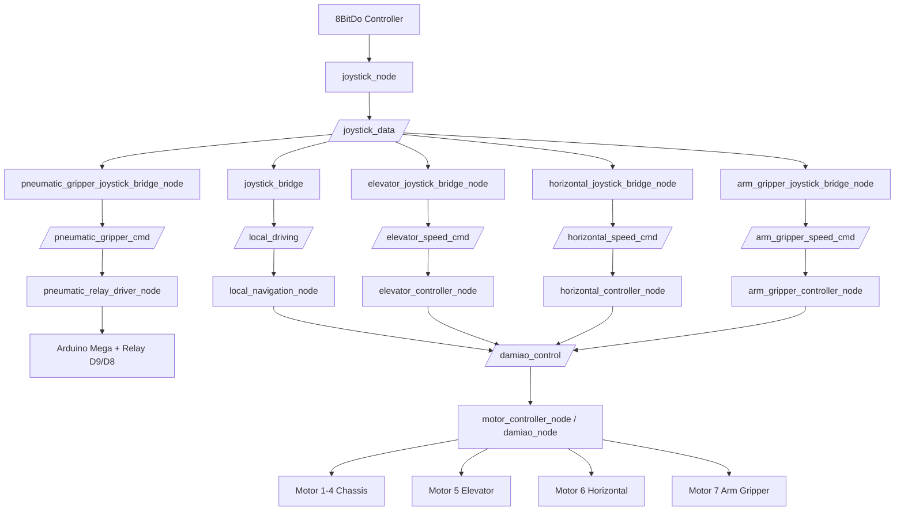
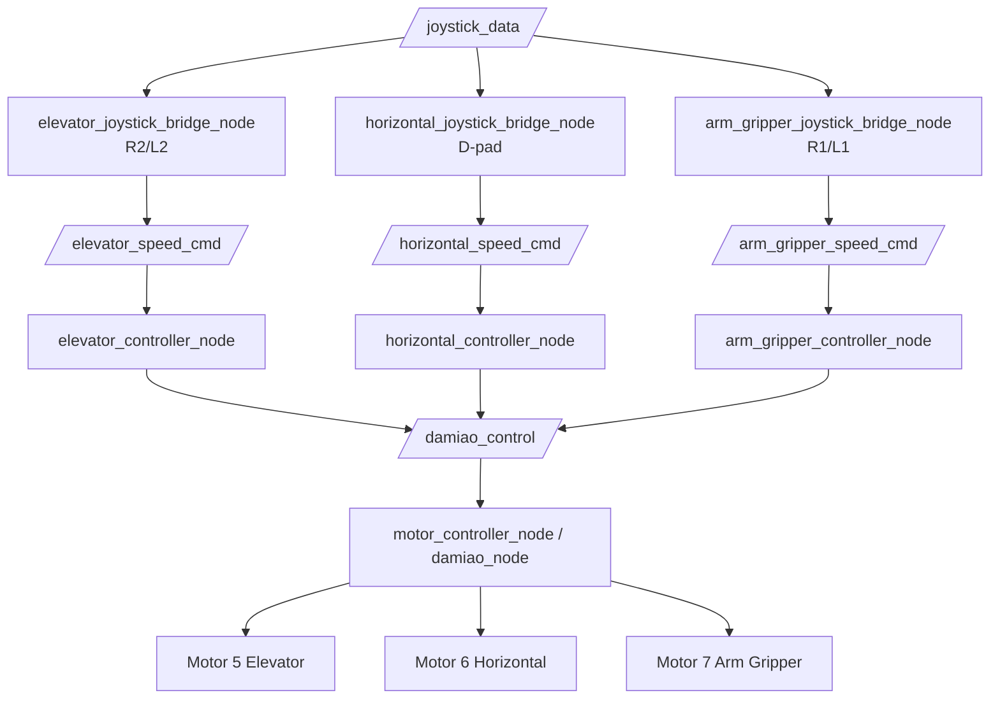
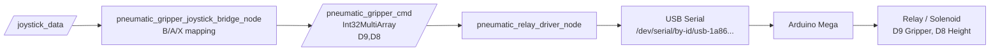
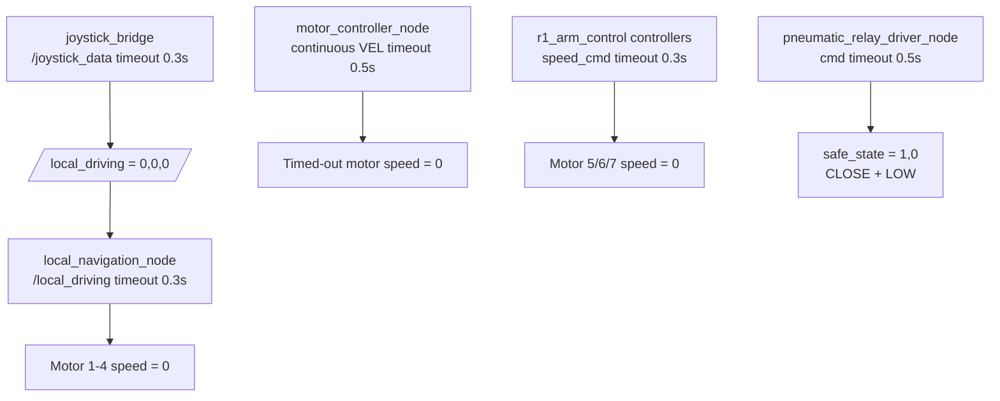

# R1 ROS 2 System Architecture

本文记录当前 R1 工作区的整体架构、node/topic 数据流和各 package 职责。

## 1. Workspace Overview

```text
new_ws/
  src/
    my_joystick_msgs
    my_joystick_driver
    joystick_bridge
    base_omniwheel_r2_700
    r1_arm_control
    arduino_pneumatic_driver
    keyboard_teleop
```

当前 R1 系统由三条主要控制链组成：

```text
1. 底盘控制链
2. Motor 5/6/7 机械臂执行机构控制链
3. Arduino pneumatic gripper 控制链
```

另外有一条可选键盘调试链：

```text
keyboard_teleop -> existing command topics
```

## 2. Architecture Graphs

### Full System Overview



### Base Chassis Chain


### Arm Motor Chain



### Pneumatic Gripper Chain



### Safety Watchdog Chain



## 3. Full Controller Runtime

当前推荐启动脚本：

```bash
./r1_start_base_1_0.sh
```

该脚本启动 tmux session：

```text
r1_control
```

tmux 窗口：

```text
0 joystick      my_joystick_driver/joystick_node
1 base_bridge   joystick_bridge/joystick_bridge
2 motors        base_omniwheel_r2_700/damiao_node
3 nav           base_omniwheel_r2_700/local_navigation_node
4 elevator      r1_arm_control/elevator_controller_node
5 elev_bridge   r1_arm_control/elevator_joystick_bridge_node
6 horizontal    r1_arm_control/horizontal_controller_node
7 horiz_bridge  r1_arm_control/horizontal_joystick_bridge_node
8 gripper       r1_arm_control/arm_gripper_controller_node
9 grip_bridge   r1_arm_control/arm_gripper_joystick_bridge_node
10 pneumatic    arduino_pneumatic_driver/pneumatic_relay_driver_node
11 pneu_bridge  arduino_pneumatic_driver/pneumatic_gripper_joystick_bridge_node
12 monitor      ROS monitor shell
```

## 4. Joystick Input Layer

Package:

```text
src/my_joystick_driver
```

Node:

```text
/joystick_node
```

Hardware input:

```text
8BitDo controller
Linux evdev
/dev/input/event*
```

Published topic:

```text
/joystick_data
type: my_joystick_msgs/msg/Joystick
rate: 20 Hz
```

Current message range:

```text
lx/ly/rx/ry: -128 .. 128
dx/dy: -128, 0, 128
l2/r2: 0 .. 128
buttons: bool
```

Custom message package:

```text
src/my_joystick_msgs
```

Message:

```text
my_joystick_msgs/msg/Joystick
```

## 5. Base Chassis Control Chain

Packages:

```text
src/joystick_bridge
src/base_omniwheel_r2_700
```

Data flow:

```text
8BitDo controller
  -> /joystick_node
  -> /joystick_data
  -> /joystick_bridge
  -> /local_driving
  -> /local_navigation_node
  -> /damiao_control
  -> /motor_controller_node
  -> USB-CAN
  -> DM Motor 1-4
```

Detailed flow:

```text
/joystick_node
  publishes /joystick_data
    type: my_joystick_msgs/msg/Joystick

/joystick_bridge
  subscribes /joystick_data
  converts left/right stick to chassis command
  publishes /local_driving
    type: std_msgs/msg/Float32MultiArray
    data = [direction_rad, speed_cm_per_sec, rotation_rad_per_sec]

/local_navigation_node
  subscribes /local_driving
  computes four-wheel omni inverse kinematics
  publishes /damiao_control
    type: std_msgs/msg/Float32MultiArray
    data = [motor_id, mode, speed_rad_s, duration]

/motor_controller_node
  implemented by damiao_node.py
  subscribes /damiao_control
  sends velocity commands through USB-CAN
  controls Motor 1-4 for chassis
```

Base motor mapping:

```text
Motor 1 = left front
Motor 2 = right front
Motor 3 = right rear
Motor 4 = left rear
```

Current base kinematics defaults:

```text
lateral_axis_sign = 1.0
rotation_axis_sign = 1.0
forward_coeff_1..4 = [1, 1, -1, -1]
lateral_coeff_1..4 = [1, -1, -1, 1]
rotation_coeff_1..4 = [1, -1, 1, -1]
motor_direction_1..4 = [-1, 1, -1, 1]
```

## 6. Arm Actuator Control Chain

Package:

```text
src/r1_arm_control
```

Controlled actuators:

```text
Motor 5 = elevator
Motor 6 = horizontal movement
Motor 7 = arm gripper motor
```

### Motor 5 Elevator

Data flow:

```text
/joystick_data
  -> /elevator_joystick_bridge_node
  -> /elevator_speed_cmd
  -> /elevator_controller_node
  -> /damiao_control
  -> /motor_controller_node
  -> Motor 5
```

Topics:

```text
/elevator_speed_cmd
type: std_msgs/msg/Float32MultiArray
data = [speed_rad_s]

/elevator_status
type: std_msgs/msg/Float32MultiArray
data = [target_speed, commanded_speed, timeout_active, motor_id]
```

Control mapping:

```text
R2: positive elevator speed
L2: negative elevator speed
```

### Motor 6 Horizontal

Data flow:

```text
/joystick_data
  -> /horizontal_joystick_bridge_node
  -> /horizontal_speed_cmd
  -> /horizontal_controller_node
  -> /damiao_control
  -> /motor_controller_node
  -> Motor 6
```

Topics:

```text
/horizontal_speed_cmd
type: std_msgs/msg/Float32MultiArray
data = [speed_rad_s]

/horizontal_status
type: std_msgs/msg/Float32MultiArray
data = [target_speed, commanded_speed, timeout_active, motor_id]
```

Control mapping:

```text
D-pad left/right: horizontal movement
D-pad up/down: power level 0.2 / 0.5 / 1.0
```

### Motor 7 Arm Gripper Motor

Data flow:

```text
/joystick_data
  -> /arm_gripper_joystick_bridge_node
  -> /arm_gripper_speed_cmd
  -> /arm_gripper_controller_node
  -> /damiao_control
  -> /motor_controller_node
  -> Motor 7
```

Topics:

```text
/arm_gripper_speed_cmd
type: std_msgs/msg/Float32MultiArray
data = [speed_rad_s]

/arm_gripper_status
type: std_msgs/msg/Float32MultiArray
data = [target_speed, commanded_speed, timeout_active, motor_id]
```

Control mapping:

```text
R1: positive gripper motor speed
L1: negative gripper motor speed
R1 + L1: stop
```

## 7. Pneumatic Gripper Control Chain

Package:

```text
src/arduino_pneumatic_driver
```

Hardware:

```text
Arduino Mega
USB Serial
2-channel relay / solenoid valve
```

Default serial port:

```text
/dev/serial/by-id/usb-1a86_USB2.0-Serial-if00-port0
```

Data flow:

```text
/joystick_data
  -> /pneumatic_gripper_joystick_bridge_node
  -> /pneumatic_gripper_cmd
  -> /pneumatic_relay_driver_node
  -> USB Serial
  -> Arduino
  -> Relay D9/D8
```

Topic:

```text
/pneumatic_gripper_cmd
type: std_msgs/msg/Int32MultiArray
data = [D9_gripper_state, D8_height_state]
```

Relay meaning:

```text
D9 gripper:
  0 = OPEN
  1 = CLOSE

D8 height:
  0 = LOW
  1 = HIGH
```

Control mapping:

```text
B: gripper OPEN while held, CLOSE when released
A: latch height HIGH
X: latch height LOW
```

Default safe state:

```text
[1, 0] = CLOSE + LOW
```

Status topic:

```text
/pneumatic_gripper_status
type: std_msgs/msg/String
```

## 8. Keyboard Teleop Debug Chain

Package:

```text
src/keyboard_teleop
```

Node:

```text
/keyboard_teleop_node
```

Purpose:

```text
Temporary low-speed debugging without a physical controller.
```

It publishes directly to existing command topics:

```text
/local_driving
/elevator_speed_cmd
/horizontal_speed_cmd
/arm_gripper_speed_cmd
/pneumatic_gripper_cmd
```

Important rule:

```text
Do not run keyboard_teleop together with joystick bridges.
```

Otherwise multiple input sources will publish to the same command topics.

## 9. Safety Architecture

### Joystick Bridge Watchdog

```text
/joystick_bridge
  watches /joystick_data
  if timeout > input_timeout_sec = 0.3 s
  publishes /local_driving = [0, 0, 0]
```

### Base Navigation Watchdog

```text
/local_navigation_node
  watches /local_driving
  if timeout > command_timeout_sec = 0.3 s
  publishes zero speed to Motor 1-4 through /damiao_control
```

### Damiao Motor Watchdog

```text
/motor_controller_node
  watches continuous VEL commands with duration = 0.0
  if motor command timeout > command_timeout_sec = 0.5 s
  sends 0 rad/s to the timed-out motor_id
```

### Arm Controllers Watchdog

```text
/elevator_controller_node
/horizontal_controller_node
/arm_gripper_controller_node
  watch their speed command topics
  if timeout > timeout_sec = 0.3 s
  publish 0 rad/s to /damiao_control
```

### Pneumatic Driver Watchdog

```text
/pneumatic_relay_driver_node
  watches /pneumatic_gripper_cmd
  if timeout > command_timeout_sec = 0.5 s
  sends safe_state = [1,0]
```

## 10. Topic Summary

| Topic | Type | Publisher | Subscriber |
|---|---|---|---|
| `/joystick_data` | `my_joystick_msgs/msg/Joystick` | `/joystick_node` | joystick bridges |
| `/local_driving` | `std_msgs/msg/Float32MultiArray` | `/joystick_bridge`, optional `/keyboard_teleop_node` | `/local_navigation_node` |
| `/damiao_control` | `std_msgs/msg/Float32MultiArray` | base/arm controllers | `/motor_controller_node` |
| `/elevator_speed_cmd` | `std_msgs/msg/Float32MultiArray` | `/elevator_joystick_bridge_node`, optional keyboard | `/elevator_controller_node` |
| `/horizontal_speed_cmd` | `std_msgs/msg/Float32MultiArray` | `/horizontal_joystick_bridge_node`, optional keyboard | `/horizontal_controller_node` |
| `/arm_gripper_speed_cmd` | `std_msgs/msg/Float32MultiArray` | `/arm_gripper_joystick_bridge_node`, optional keyboard | `/arm_gripper_controller_node` |
| `/pneumatic_gripper_cmd` | `std_msgs/msg/Int32MultiArray` | `/pneumatic_gripper_joystick_bridge_node`, optional keyboard | `/pneumatic_relay_driver_node` |
| `/elevator_status` | `std_msgs/msg/Float32MultiArray` | `/elevator_controller_node` | monitor |
| `/horizontal_status` | `std_msgs/msg/Float32MultiArray` | `/horizontal_controller_node` | monitor |
| `/arm_gripper_status` | `std_msgs/msg/Float32MultiArray` | `/arm_gripper_controller_node` | monitor |
| `/pneumatic_gripper_status` | `std_msgs/msg/String` | `/pneumatic_relay_driver_node` | monitor |

## 11. Current Important Defaults

```text
Joystick axis range: -128 .. 128
Joystick trigger range: 0 .. 128
Joystick deadzone: 6

joystick_bridge:
  max_speed_cm = 20.0
  max_rotation = 0.5
  input_timeout_sec = 0.3

local_navigation_node:
  max_wheel_speed_rad_s = 3.0
  max_wheel_accel_rad_s2 = 12.0
  command_timeout_sec = 0.3
  omniwheel_radius_m = 0.0635

damiao_node / motor_controller_node:
  motor_ids = [1,2,3,4,5,6,7]
  command_timeout_sec = 0.5

arduino_pneumatic_driver:
  safe_state = [1,0]
  command_timeout_sec = 0.5
```
