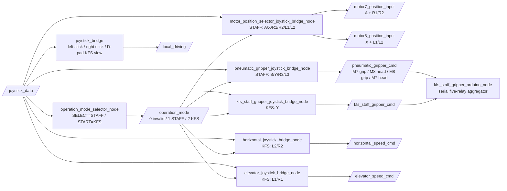

# R1 Controller Usage - Current Keymap

> Last updated: 2026-06-20, source-verified against current Python nodes
> 本文件是目前手柄操作的唯一準則。其他 README 中較早日期的鍵位章節保留為歷史紀錄；實機操作以本文件為準。

## 1. Operation Mode

手柄中間兩個鍵只負責切換模式，不直接移動 motor，也不直接切 relay。

| 按鍵 | 模式 | `/operation_mode` |
|---|---|---|
| SELECT / 中左 | STAFF mode | `1` |
| START / 中右 | KFS mode | `2` |
| 手柄超時 | INVALID | `0` |

比賽 zone 用法：

```text
Zone 1: 機手切到 STAFF mode
Zone 2: 機手切到 KFS mode
Zone 3: 機手自行在 STAFF / KFS mode 之間切換
```

## 2. Always Active Controls

以下控制不受 STAFF/KFS mode 影響：

| 控制 | 功能 |
|---|---|
| Left stick | 底盤平移，人視角控制 |
| Right stick | 底盤旋轉 |
| D-pad | 設定 KFS visual front 在人視角中的方向 |
| X + Y + B + A 長按 5 秒 | Raspberry Pi shutdown command |

D-pad 語義：

| D-pad | 意義 |
|---|---|
| Up | KFS visual front 在機手前方 |
| Right | KFS visual front 在機手右方 |
| Down | KFS visual front 在機手後方 / 靠近機手 |
| Left | KFS visual front 在機手左方 |

目前實機校正後的換算：

```text
body_front_view = (KFS view - 1) % 4
```

開機預設等同 D-pad Up，也就是 `view=0`，假設 KFS visual front 在機手前方。

## 3. STAFF Mode Current Keymap

進入 STAFF mode：

```text
按 SELECT / 中左
/operation_mode = 1
```

| 控制 | 功能 | ROS output |
|---|---|---|
| A | Motor7 左右 90° / preset cycle only | `/motor7_position_input` toggle |
| X | Motor8 左右 90° / preset cycle only | `/motor8_position_input` toggle |
| B | Motor7 staff gripper relay toggle only | `/pneumatic_gripper_cmd[0]` |
| Y | Motor8 staff gripper relay toggle only | `/pneumatic_gripper_cmd[2]` |
| R1 | Motor7 manual trim negative | `/motor7_position_input[1] < 0` |
| R2 | Motor7 manual trim positive | `/motor7_position_input[1] > 0` |
| L1 | Motor8 manual trim negative | `/motor8_position_input[1] < 0` |
| L2 | Motor8 manual trim positive | `/motor8_position_input[1] > 0` |
| R3 / P1 | Motor7 head / inclination relay toggle | `/pneumatic_gripper_cmd[3]` |
| L3 / P2 | Motor8 head / inclination relay toggle | `/pneumatic_gripper_cmd[1]` |

注意：

```text
A/X 只控制位置模式 preset / 90° cycle，不再切 gripper relay。
B/Y 只控制 staff gripper relay，不再送 position preset。
R3/L3 來自手柄背鍵 remap：P1=R3，P2=L3。
```

STAFF pneumatic topic 順序：

```text
/pneumatic_gripper_cmd = [M7 gripper, M8 inclination, M8 gripper, M7 inclination]
safe_state = [1,0,1,0]
```

## 4. KFS Mode Current Keymap

進入 KFS mode：

```text
按 START / 中右
/operation_mode = 2
```

| 控制 | 功能 | ROS output |
|---|---|---|
| Y | KFS gripper open/close toggle | `/kfs_staff_gripper_cmd` |
| L2 | Motor6 horizontal positive / out | `/horizontal_speed_cmd = +30.0 rad/s` at full trigger |
| R2 | Motor6 horizontal negative / in | `/horizontal_speed_cmd = -30.0 rad/s` at full trigger |
| L1 | Motor5 elevator negative / down | `/elevator_speed_cmd = -28.0 rad/s` |
| R1 | Motor5 elevator positive / up | `/elevator_speed_cmd = +28.0 rad/s` |

KFS mode 不使用 A/B/X、L3/R3 來控制機構；左搖桿、右搖桿、D-pad 仍照常控制底盤視角。

## 5. Arduino Five-Relay Order

最新 Arduino sketch 使用 5 路 relay：

```text
relayPins = {22, 24, 25, 27, 28}
serial format = [r1,r2,r3,r4,r5]
HIGH = ON, LOW = OFF
```

ROS serial order：

```text
[KFS gripper, M7 gripper, M8 inclination, M8 gripper, M7 inclination]
```

全系統安全狀態：

```text
[0,1,0,1,0]
```

Topic 聚合：

```text
/kfs_staff_gripper_cmd -> serial[0]
/pneumatic_gripper_cmd -> serial[1:5]
```

## 6. Runtime Node Graph



## 7. Quick Test

啟動系統後開多個 terminal 觀察：

```bash
ros2 topic echo /operation_mode
ros2 topic echo /motor7_position_input
ros2 topic echo /motor8_position_input
ros2 topic echo /pneumatic_gripper_cmd
ros2 topic echo /kfs_staff_gripper_cmd
ros2 topic echo /horizontal_speed_cmd
ros2 topic echo /elevator_speed_cmd
```

STAFF mode 預期：

```text
SELECT -> /operation_mode = 1
A      -> /motor7_position_input toggle
X      -> /motor8_position_input toggle
B      -> /pneumatic_gripper_cmd[0] toggle
Y      -> /pneumatic_gripper_cmd[2] toggle
R1/R2  -> /motor7_position_input trim negative/positive
L1/L2  -> /motor8_position_input trim negative/positive
R3/P1  -> /pneumatic_gripper_cmd[3] toggle
L3/P2  -> /pneumatic_gripper_cmd[1] toggle
```

KFS mode 預期：

```text
START -> /operation_mode = 2
Y     -> /kfs_staff_gripper_cmd toggle
L2/R2 -> /horizontal_speed_cmd positive/negative
L1/R1 -> /elevator_speed_cmd negative/positive
```

## 8. Current KFS Mechanism Speeds

Latest source defaults:

```text
Motor5 elevator: 28.0 rad/s
  /elevator_joystick_bridge_node.command_speed_rad_s = 28.0
  /elevator_controller_node.max_speed_rad_s = 28.0

Motor6 horizontal: 30.0 rad/s
  /horizontal_joystick_bridge_node.command_speed_rad_s = 30.0
  /horizontal_controller_node.max_speed_rad_s = 30.0
```

These speeds only apply in KFS mode (`/operation_mode=2`). STAFF mode still forces elevator/horizontal bridge output to `0.0`.

## 2026-06-20 STAFF D-pad Down Motor7/Motor8 Swap

目前 STAFF mode 會讀取 `/view_orientation`。規則：

```text
/view_orientation = 0  # D-pad 上，KFS visual front 在機手前方
  STAFF mapping 保持正常：Motor7 按鍵仍控制 Motor7，Motor8 按鍵仍控制 Motor8

/view_orientation = 2  # D-pad 下，KFS visual front 在機手後方
  STAFF mapping 對調：所有 Motor7 staff gripper 控制改送 Motor8，所有 Motor8 staff gripper 控制改送 Motor7
```

D-pad 左/右 (`1/3`) 目前不觸發對調，保持正常 mapping。對調只在 STAFF mode (`/operation_mode=1`) 影響 staff gripper 相關控制；KFS mode、底盤左/右搖桿、Motor5 elevator、Motor6 horizontal 不受影響。

正常 mapping：

```text
A -> Motor7 90° / preset
X -> Motor8 90° / preset
B -> Motor7 staff gripper relay
Y -> Motor8 staff gripper relay
R1/R2 -> Motor7 trim -/+
L1/L2 -> Motor8 trim -/+
R3/P1 -> Motor7 inclination/head relay
L3/P2 -> Motor8 inclination/head relay
```

D-pad 下 swap mapping：

```text
A -> Motor8 90° / preset
X -> Motor7 90° / preset
B -> Motor8 staff gripper relay
Y -> Motor7 staff gripper relay
R1 -> Motor8 trim positive
R2 -> Motor8 trim negative
L1 -> Motor7 trim positive
L2 -> Motor7 trim negative
R3/P1 -> Motor8 inclination/head relay
L3/P2 -> Motor7 inclination/head relay
```

相關參數：

```text
motor_position_selector_joystick_bridge_node.swap_staff_grippers_on_view_down = true
pneumatic_gripper_joystick_bridge_node.swap_staff_grippers_on_view_down = true
```

## 2026-06-20 Chassis Rotation Speed

Right stick rotation speed default is now:

```text
joystick_bridge.max_rotation = 3.0 rad/s
```

The rotation curve remains:

```text
rotation = (0.1x + 0.9x^3) * max_rotation
```

So small right-stick input still gives fine control, while full right-stick input can request up to `3.0 rad/s`. Actual chassis motion may still be scaled by `local_navigation_node.max_wheel_speed_rad_s = 40.0 rad/s` when translation and rotation are combined.

### 2026-06-20 STAFF D-pad Down Trim Direction Update

D-pad 下的 STAFF swap 現在也會把微調方向一起對調：`R1/R2` 互換、`L1/L2` 互換。因此 D-pad 下時：

```text
R1 -> Motor8 trim positive
R2 -> Motor8 trim negative
L1 -> Motor7 trim positive
L2 -> Motor7 trim negative
```

D-pad 上仍保持原本：`R1/R2=Motor7 -/+`，`L1/L2=Motor8 -/+`。

maintainer: Hero@EdUHK robotics team 2026 | github: herolch07
