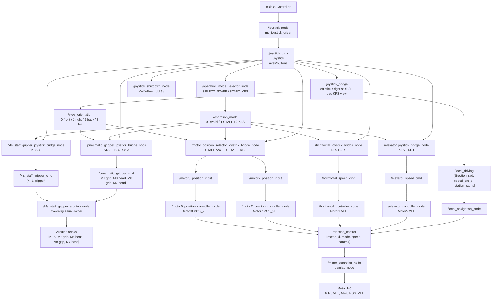
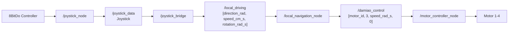
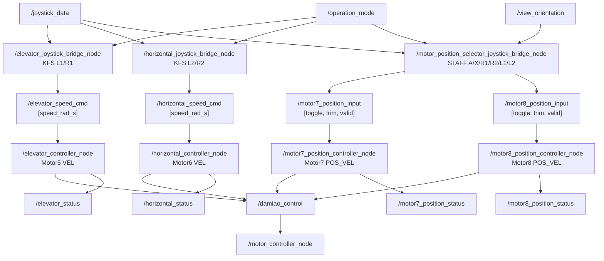
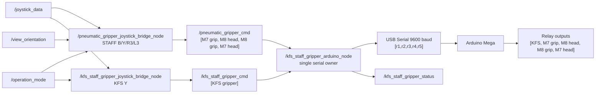
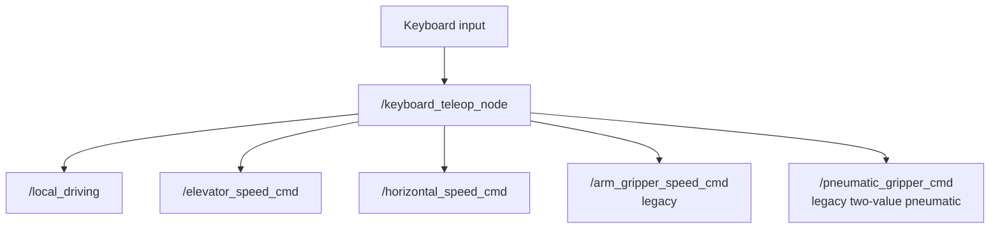
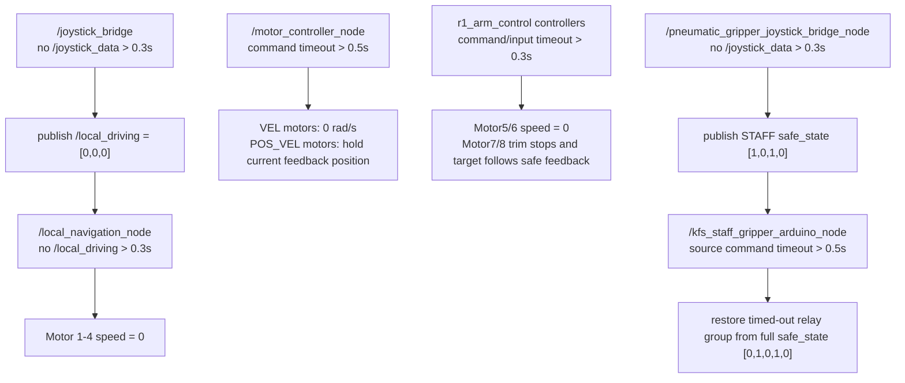
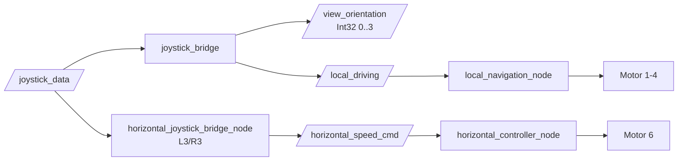
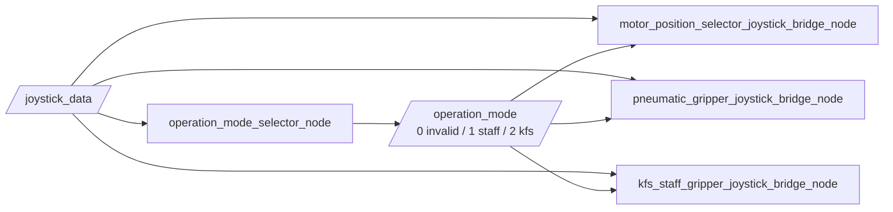
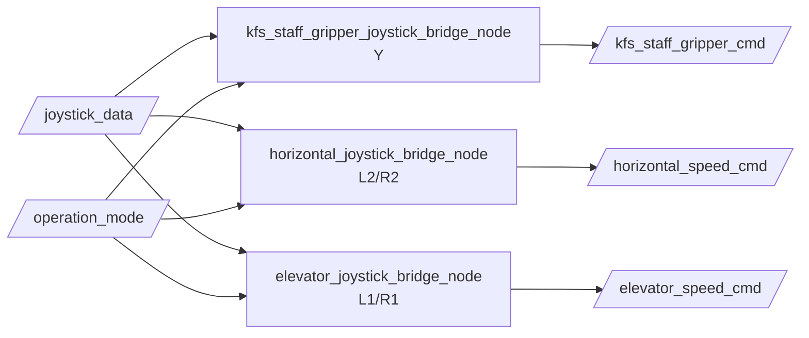

> 2026-06-19 現行操作入口：目前手柄鍵位、STAFF/KFS mode、D-pad 視角、五路 relay 順序請先看 [`CONTROLLER_USAGE.md`](CONTROLLER_USAGE.md)。本文若是舊測試/排查紀錄，內容保留作歷史，不代表目前實機鍵位。

> 2026-06-19 現行操作準則：手柄鍵位、STAFF/KFS mode、D-pad 視角與五路 relay 順序以 [`CONTROLLER_USAGE.md`](CONTROLLER_USAGE.md) 為唯一準則。本文件較早日期的鍵位段落保留為歷史紀錄，不作為目前實機操作依據。

# R1 Node / Topic Graph

本文专门说明当前 R1 ROS 2 系统里各个 node 如何串联、topic 如何传递，以及每个 topic 的数据格式。

## 1. Source-Verified Current Overview



## 2. 底盘链路



解释：

```text
/joystick_node:
  读取手柄，发布 /joystick_data

/joystick_bridge:
  把左摇杆/右摇杆转换成底盘移动指令 /local_driving

/local_navigation_node:
  把底盘目标速度转换成 Motor 1-4 的轮速

/motor_controller_node:
  通过 USB-CAN 发送达妙电机命令
```

底盘相关 topic：

| Topic | Type | 数据格式 | 作用 |
|---|---|---|---|
| `/joystick_data` | `my_joystick_msgs/msg/Joystick` | `lx ly rx ry l2 r2 buttons` | 手柄状态 |
| `/local_driving` | `std_msgs/msg/Float32MultiArray` | `[direction_rad, speed_cm_s, rotation_rad_s]` | 底盘目标运动 |
| `/damiao_control` | `std_msgs/msg/Float32MultiArray` | `[motor_id, mode, speed_rad_s, duration]` | 达妙电机命令 |

## 3. 機構 Motor 5/6/7/8 鏈路



解释：

```text
Motor5/Motor6:
  KFS mode only, VEL command through /damiao_control mode=3

Motor7/Motor8:
  STAFF mode only, POS_VEL command through /damiao_control mode=2
  A cycles Motor7 positions; X cycles Motor8 positions
  R1/R2 trim Motor7; L1/L2 trim Motor8
  D-pad down view swaps Motor7/Motor8 controls and reverses each trim pair direction

/motor_controller_node:
  统一控制 Motor 1-8；Motor7/8 configured as position_mode_motor_ids=[7,8]
```

## 4. Pneumatic / Arduino Five-Relay 鏈路



解释：

```text
/pneumatic_gripper_joystick_bridge_node:
  STAFF mode only, publishes [M7 gripper, M8 inclination, M8 gripper, M7 inclination]
  D-pad down view swaps Motor7/Motor8 relay controls

/kfs_staff_gripper_joystick_bridge_node:
  KFS mode only, Y toggles [KFS gripper]

/kfs_staff_gripper_arduino_node:
  merges both topics into the Arduino five-relay serial command
```

当前 Arduino serial order：

```text
[KFS gripper, M7 gripper, M8 inclination, M8 gripper, M7 inclination]
full safe_state = [0,1,0,1,0]
```

## 5. Keyboard Teleop 旁路



注意：

```text
keyboard_teleop 不应和 joystick bridge 同时运行，否则会有两个输入源同时发布相同 command topic。
当前 keyboard_teleop 的 pneumatic 输出仍是旧二路格式，不适用于五路 Arduino panel；比赛操作不要用 keyboard 控制 pneumatic。
```

## 6. Safety / Timeout Graph



## 7. Node Summary

| Node | Package | 主要作用 |
|---|---|---|
| `/joystick_node` | `my_joystick_driver` | 读取手柄，发布 `/joystick_data` |
| `/joystick_bridge` | `joystick_bridge` | 手柄摇杆到底盘 `/local_driving`，D-pad 发布 `/view_orientation` |
| `/local_navigation_node` | `base_omniwheel_r2_700` | 底盘运动学，计算 Motor 1-4 轮速 |
| `/motor_controller_node` | `base_omniwheel_r2_700` | 达妙电机 driver，控制 Motor 1-8；Motor7/8 为 POS_VEL |
| `/operation_mode_selector_node` | `operation_mode_control` | SELECT=STAFF，START=KFS，发布 `/operation_mode` |
| `/elevator_joystick_bridge_node` | `r1_arm_control` | KFS L1/R1 -> `/elevator_speed_cmd` |
| `/elevator_controller_node` | `r1_arm_control` | 控制 Motor 5 |
| `/horizontal_joystick_bridge_node` | `r1_arm_control` | KFS L2/R2 -> `/horizontal_speed_cmd` |
| `/horizontal_controller_node` | `r1_arm_control` | 控制 Motor 6 |
| `/motor_position_selector_joystick_bridge_node` | `r1_arm_control` | STAFF A/X/R1/R2/L1/L2 -> Motor7/8 position inputs |
| `/motor7_position_controller_node` | `r1_arm_control` | 控制 Motor 7 POS_VEL |
| `/motor8_position_controller_node` | `r1_arm_control` | 控制 Motor 8 POS_VEL |
| `/pneumatic_gripper_joystick_bridge_node` | `arduino_pneumatic_driver` | STAFF B/Y/R3/L3 -> `/pneumatic_gripper_cmd` |
| `/kfs_staff_gripper_joystick_bridge_node` | `kfs_staff_gripper` | KFS Y -> `/kfs_staff_gripper_cmd` |
| `/kfs_staff_gripper_arduino_node` | `kfs_staff_gripper` | ROS topics -> five-relay USB Serial -> Arduino |
| `/joystick_shutdown_node` | `robot_power_control` | X+Y+B+A 長按 5 秒 -> shutdown command |
| `/keyboard_teleop_node` | `keyboard_teleop` | 鍵盤調試輸入；pneumatic path is legacy two-value format |

## 8. Node Pub/Sub Table

这个表直接说明当前 start base 系统里每个 node 订阅什么、发布什么。

| Node | Subscribe | Publish | 说明 |
|---|---|---|---|
| `/joystick_node` | Linux evdev 硬件输入 | `/joystick_data` | 把手柄输入变成 ROS2 Joystick message |
| `/operation_mode_selector_node` | `/joystick_data` | `/operation_mode` | SELECT=STAFF，START=KFS |
| `/joystick_bridge` | `/joystick_data` | `/local_driving`, `/view_orientation` | 左/右搖桿到底盤，D-pad 到 KFS visual-front 視角 |
| `/local_navigation_node` | `/local_driving` | `/damiao_control` | 把底盘目标移动换算成 Motor 1-4 轮速 |
| `/motor_controller_node` | `/damiao_control` | `/damiao_motor_status` | 达妙电机 driver，控制 Motor 1-8；Motor7/8 为 POS_VEL |
| `/elevator_joystick_bridge_node` | `/joystick_data`, `/operation_mode` | `/elevator_speed_cmd` | KFS mode L1/R1 转 Motor5 速度命令 |
| `/elevator_controller_node` | `/elevator_speed_cmd` | `/damiao_control`, `/elevator_status` | 控制 Motor 5 elevator |
| `/horizontal_joystick_bridge_node` | `/joystick_data`, `/operation_mode` | `/horizontal_speed_cmd` | KFS mode L2/R2 转 Motor6 速度命令 |
| `/horizontal_controller_node` | `/horizontal_speed_cmd` | `/damiao_control`, `/horizontal_status` | 控制 Motor 6 horizontal |
| `/motor_position_selector_joystick_bridge_node` | `/joystick_data`, `/operation_mode`, `/view_orientation` | `/motor7_position_input`, `/motor8_position_input`, `/motor_position_selector_status` | STAFF mode Motor7/8 preset/trim selector |
| `/motor7_position_controller_node` | `/motor7_position_input`, `/damiao_motor_status` | `/damiao_control`, `/motor7_position_status` | 控制 Motor7 POS_VEL |
| `/motor8_position_controller_node` | `/motor8_position_input`, `/damiao_motor_status` | `/damiao_control`, `/motor8_position_status` | 控制 Motor8 POS_VEL |
| `/pneumatic_gripper_joystick_bridge_node` | `/joystick_data`, `/operation_mode`, `/view_orientation` | `/pneumatic_gripper_cmd` | STAFF mode B/Y/R3/L3 到四路 staff relay command |
| `/kfs_staff_gripper_joystick_bridge_node` | `/joystick_data`, `/operation_mode` | `/kfs_staff_gripper_cmd` | KFS mode Y 到 KFS gripper command |
| `/kfs_staff_gripper_arduino_node` | `/pneumatic_gripper_cmd`, `/kfs_staff_gripper_cmd` | `/kfs_staff_gripper_status`，并写 USB Serial | 唯一 Arduino 五路 relay serial owner |
| `/joystick_shutdown_node` | `/joystick_data` | `/robot_power_status` | X+Y+B+A 長按 5 秒執行 shutdown command |
| `/keyboard_teleop_node` | 键盘输入 | legacy command topics | 只作低速調試；pneumatic path 仍是舊二值格式 |

## 9. Topic Publisher / Subscriber Table

这个表从 topic 角度说明：谁发布、谁订阅、数据格式是什么。

| Topic | Type | Publisher | Subscriber | Data |
|---|---|---|---|---|
| `/joystick_data` | `my_joystick_msgs/msg/Joystick` | `/joystick_node` | `/joystick_bridge`, `/operation_mode_selector_node`, mechanism bridge nodes, pneumatic bridge nodes, `/joystick_shutdown_node` | 手柄轴和按键，轴范围 `-512..512` |
| `/operation_mode` | `std_msgs/msg/Int32` | `/operation_mode_selector_node` | mechanism bridge nodes | `0 invalid / 1 STAFF / 2 KFS` |
| `/view_orientation` | `std_msgs/msg/Int32` | `/joystick_bridge` | STAFF position/pneumatic bridge nodes | `0 front / 1 right / 2 back / 3 left` |
| `/local_driving` | `std_msgs/msg/Float32MultiArray` | `/joystick_bridge` 或 legacy `/keyboard_teleop_node` | `/local_navigation_node` | `[direction_rad, speed_cm_s, rotation_rad_s]` |
| `/damiao_control` | `std_msgs/msg/Float32MultiArray` | `/local_navigation_node`, `/elevator_controller_node`, `/horizontal_controller_node`, `/motor7_position_controller_node`, `/motor8_position_controller_node` | `/motor_controller_node` | `[motor_id, mode, speed_or_max_speed, duration_or_target_position]` |
| `/damiao_motor_status` | `std_msgs/msg/Float32MultiArray` | `/motor_controller_node` | position controllers / monitor | Motor feedback and active control mode |
| `/elevator_speed_cmd` | `std_msgs/msg/Float32MultiArray` | `/elevator_joystick_bridge_node` 或 legacy keyboard | `/elevator_controller_node` | `[speed_rad_s]` |
| `/horizontal_speed_cmd` | `std_msgs/msg/Float32MultiArray` | `/horizontal_joystick_bridge_node` 或 legacy keyboard | `/horizontal_controller_node` | `[speed_rad_s]` |
| `/motor7_position_input` | `std_msgs/msg/Float32MultiArray` | `/motor_position_selector_joystick_bridge_node` | `/motor7_position_controller_node` | `[toggle_event, trim_input, valid]` |
| `/motor8_position_input` | `std_msgs/msg/Float32MultiArray` | `/motor_position_selector_joystick_bridge_node` | `/motor8_position_controller_node` | `[toggle_event, trim_input, valid]` |
| `/pneumatic_gripper_cmd` | `std_msgs/msg/Int32MultiArray` | `/pneumatic_gripper_joystick_bridge_node` | `/kfs_staff_gripper_arduino_node` | `[M7 gripper, M8 inclination, M8 gripper, M7 inclination]` |
| `/kfs_staff_gripper_cmd` | `std_msgs/msg/Int32MultiArray` | `/kfs_staff_gripper_joystick_bridge_node` | `/kfs_staff_gripper_arduino_node` | `[KFS gripper]` |
| `/elevator_status` | `std_msgs/msg/Float32MultiArray` | `/elevator_controller_node` | monitor / debug terminal | `[target_speed, commanded_speed, timeout_active, motor_id]` |
| `/horizontal_status` | `std_msgs/msg/Float32MultiArray` | `/horizontal_controller_node` | monitor / debug terminal | `[target_speed, commanded_speed, timeout_active, motor_id]` |
| `/motor7_position_status` | `std_msgs/msg/Float32MultiArray` | `/motor7_position_controller_node` | monitor / debug terminal | `[target, actual, velocity, selected, trim, feedback_valid, input_timeout, motor_id, at_target]` |
| `/motor8_position_status` | `std_msgs/msg/Float32MultiArray` | `/motor8_position_controller_node` | monitor / debug terminal | `[target, actual, velocity, selected, trim, feedback_valid, input_timeout, motor_id, at_target]` |
| `/kfs_staff_gripper_status` | `std_msgs/msg/String` | `/kfs_staff_gripper_arduino_node` | monitor / debug terminal | human-readable serial/status text |
| `/robot_power_status` | `std_msgs/msg/String` | `/joystick_shutdown_node` | monitor / debug terminal | shutdown dry-run/execute status |

## 10. Topic Meaning Details

### `/joystick_data`

```text
Publisher:
  /joystick_node

Subscribers:
  /joystick_bridge
  /elevator_joystick_bridge_node
  /horizontal_joystick_bridge_node
  /operation_mode_selector_node
  /motor_position_selector_joystick_bridge_node
  /pneumatic_gripper_joystick_bridge_node
  /kfs_staff_gripper_joystick_bridge_node
  /elevator_joystick_bridge_node
  /horizontal_joystick_bridge_node
  /joystick_shutdown_node
```

这是所有 controller 输入的源头。底盘、机械臂、气动各自的 bridge node 都从这里读取手柄状态。

### `/local_driving`

```text
Publisher:
  /joystick_bridge
  或 /keyboard_teleop_node

Subscriber:
  /local_navigation_node
```

这是底盘高层移动指令，不是单个轮子的速度。`local_navigation_node` 会把它转换成 Motor 1-4 的 wheel speed。

### `/damiao_control`

```text
Publishers:
  /local_navigation_node
  /elevator_controller_node
  /horizontal_controller_node
  /motor7_position_controller_node
  /motor8_position_controller_node

Subscriber:
  /motor_controller_node
```

这是达妙电机统一底层控制 topic。Motor 1-8 最终都会走这里；Motor7/8 使用 mode=2 POS_VEL。

### `/pneumatic_gripper_cmd`

```text
Publisher:
  /pneumatic_gripper_joystick_bridge_node
  或 /keyboard_teleop_node

Subscriber:
  /kfs_staff_gripper_arduino_node
```

这是 STAFF pneumatic 四路 relay 控制 topic。它不会进入 `/damiao_control`，而是由 `kfs_staff_gripper_arduino_node` 合并 KFS command 后转成五路 USB Serial 字符串发给 Arduino。

## 11. 最重要的理解

```text
手柄输入只产生 /joystick_data。

底盘、机械臂、气动各自有 bridge node 把 /joystick_data 转成自己的 command topic。

达妙 Motor 1-8 最后都汇总到 /damiao_control，由 /motor_controller_node 统一发给电机。

Arduino pneumatic 不经过 /damiao_control。
它走 /pneumatic_gripper_cmd -> serial -> Arduino -> relay。
```

## Domain Isolation

The R1 node graph is only valid after ROS2 domain isolation is applied. The R1 startup script exports:

```bash
ROS_DOMAIN_ID=1
ROS_LOCALHOST_ONLY=1
```

If `/damiao_motor_controller`, `/global_navigation_node`, `/base/dummy_control`, or `/arm/damiao_control` appears on R1, those entries are from another ROS2 graph and must be isolated before testing.

## 2026-06-06 控制输入更新

`/joystick_bridge` 将左摇杆平移映射到 `0..150 cm/s`，右摇杆旋转映射到 `-3.0..3.0 rad/s`；两者均使用 `0.1x + 0.9x³`。START/SELECT 当前不参与底盘调速。

## 2026-06-07 Damiao 恢复状态 Topic

```mermaid
flowchart LR
    Feedback[Motor 1-7 CAN feedback] --> Driver[/motor_controller_node]
    Driver --> Status[/damiao_motor_status]
    Driver --> Gate{RECOVERING or WAIT_NEUTRAL?}
    Gate -->|Yes| Zero[only 0 rad/s]
    Gate -->|READY| Command[allow /damiao_control]
```

`/damiao_motor_status` 类型为 `std_msgs/msg/Float32MultiArray`，格式为 `[motor_id, state_code, feedback_fresh, is_enabled, feedback_age_sec, recovery_attempts, neutral_received]`。


## 2026-06-12 Motor 8 POS_VEL 实验链路

```text
/joystick_data
  -> /motor8_position_joystick_bridge_node
  -> /motor8_position_input [toggle_event, trim_input, input_valid]
  -> /motor8_position_controller_node
  -> /damiao_control [8, 2, speed_rad_s, target_position_rad]
  -> /motor_controller_node (damiao_node)
  -> USB-CAN
  -> Motor 8
```

状态链路：

```text
/damiao_motor_status -> /motor8_position_controller_node
/motor8_position_controller_node -> /motor8_position_status
```

Motor 7 原有 `/arm_gripper_speed_cmd` 链路保持不变。

## 2026-06-13 Motor 7/8 共享 selector

```text
/joystick_data
  -> /motor_position_selector_joystick_bridge_node
       START: selected_motor 7 <-> 8 (default 7)
       X: selected motor A/B
       L2/R2: selected motor trim
  -> /motor7_position_input -> /motor7_position_controller_node -> /damiao_control
  -> /motor8_position_input -> /motor8_position_controller_node -> /damiao_control
  -> /motor_controller_node -> Motor 7/8 POS_VEL
```

旧 Motor 7 `/arm_gripper_speed_cmd` 链路不再由主启动脚本运行。

## 2026-06-13 三位置状态

```text
X rising edge -> selected_position = (selected_position + 1) mod 3
0 -> 0 rad
1 -> +35 rad
2 -> -35 rad
```

该状态由 Motor 7/8 controller 独立保存，共享 selector 只负责把 X 事件路由给当前电机。


## 2026-06-15 人視角與 Motor6 現行節點圖

本節取代前文把 D-pad 直接連到 Motor6 的現行描述。



```text
D-pad -> joystick_bridge view selection only
L2/R2 -> horizontal_joystick_bridge_node -> /horizontal_speed_cmd [-30..+30]；P1/P2 remap 為 R3/L3，用於 STAFF head relay
```

視角值為 `0=前、1=右、2=後、3=左`；左搖桿回中後才接受新值。本功能已於
2026-06-15 完成實機測試。

## 2026-06-18 Historical Runtime Node Graph Override（superseded）

本節原本記錄七路 relay 和舊 runtime override。它已被本文開頭 `Source-Verified Current Overview` 取代。現行 start base runtime 不啟動 `arm_gripper_controller_node`、`arm_gripper_joystick_bridge_node` 或 `pneumatic_relay_driver_node`；Motor7/8 走 POS_VEL position controllers，Arduino 走五路 `kfs_staff_gripper_arduino_node`。

## 2026-06-19 KFS gripper 人視角節點圖更新

本節取代 2026-06-15 中把 `/view_orientation` 解讀為 E-stop 方向的描述。節點連線不變，只有 `joystick_bridge` 的 D-pad 語義改為 KFS gripper 方向：

```text
D-pad -> joystick_bridge KFS-view selection only
/view_orientation -> KFS gripper view, 0=front, 1=right, 2=back, 3=left
joystick_bridge internal conversion -> E-stop/body-front view = (KFS view + 1) % 4
```

左搖桿回中後才接受新視角；右搖桿旋轉、Motor6 `L3/R3` 控制、`/local_driving` topic 與底層 `local_navigation_node` 均不變。


## 2026-06-19 KFS gripper 車頭標節點圖更新

本節取代同日 KFS `+1` 偏移方案。節點連線不變，D-pad 的語義為 KFS gripper／車頭方向：

```text
D-pad -> joystick_bridge KFS/body-front view selection only
/view_orientation -> KFS gripper/body-front view, 0=front, 1=right, 2=back, 3=left
joystick_bridge internal conversion -> body_front_view = KFS view
```

左搖桿回中後才接受新視角；右搖桿旋轉、Motor6 `L3/R3` 控制、`/local_driving` topic 與底層 `local_navigation_node` 均不變。


## 2026-06-19 KFS gripper 開機預設節點圖更新

節點連線不變。`joystick_bridge` 啟動預設改為：

```text
/view_orientation = 0
0 = KFS gripper / body-front in operator-frame front
```

D-pad 仍只更新視角，不直接命令底盤旋轉。


## 2026-06-19 KFS 車頭標 90 度校正節點圖更新

節點連線不變，`joystick_bridge` 的內部校正公式更新為：

```text
/view_orientation -> KFS gripper / visual-front view
joystick_bridge internal conversion -> body_front_view = (KFS view - 1) % 4
```

D-pad 仍只更新視角，不直接命令底盤旋轉。


## 2026-06-19 STAFF/KFS operation mode node graph



`joystick_bridge` / `/local_driving` 不接 `/operation_mode`，所以底盤控制不受 STAFF/KFS mode 影響。


## 2026-06-19 KFS mode elevator/horizontal node graph



以上三個 bridge 只有在 `/operation_mode=2` 時接受對應按鍵。


## 2026-06-19 five-relay pneumatic node graph update

```text
/kfs_staff_gripper_cmd [KFS]
/pneumatic_gripper_cmd [M7 gripper, M8 inclination, M8 gripper, M7 inclination]
        -> kfs_staff_gripper_arduino_node
        -> Arduino serial [KFS, M7 gripper, M8 inclination, M8 gripper, M7 inclination]
```

Motor7/Motor8 height relay nodes/keys are no longer part of the active graph.


## 2026-06-19 STAFF/KFS keymap correction node graph

```text
STAFF mode:
Y -> motor_position_selector_joystick_bridge_node -> /motor7_position_input toggle
Y -> pneumatic_gripper_joystick_bridge_node -> /pneumatic_gripper_cmd M7 gripper
A -> motor_position_selector_joystick_bridge_node -> /motor8_position_input toggle
A -> pneumatic_gripper_joystick_bridge_node -> /pneumatic_gripper_cmd M8 gripper
R1/R2 -> /motor7_position_input trim
L1/L2 -> /motor8_position_input trim

KFS mode:
L2/R2 -> horizontal_joystick_bridge_node -> /horizontal_speed_cmd positive/negative
```


## 2026-06-19 STAFF L3/R3 head relay node graph

```text
STAFF mode:
L3 -> pneumatic_gripper_joystick_bridge_node -> /pneumatic_gripper_cmd M8 inclination
R3 -> pneumatic_gripper_joystick_bridge_node -> /pneumatic_gripper_cmd M7 inclination
```


## 2026-06-19 Final STAFF Gripper / 90-Degree Split

This section supersedes any same-day text that says Y/A also toggle gripper relays.

Current STAFF mode split:

```text
Y  -> Motor7 left-right 90-degree / preset cycle only
A  -> Motor8 left-right 90-degree / preset cycle only
B  -> Motor7 staff gripper relay toggle only
X  -> Motor8 staff gripper relay toggle only
R1 -> Motor7 manual trim negative
R2 -> Motor7 manual trim positive
L1 -> Motor8 manual trim negative
L2 -> Motor8 manual trim positive
R3 -> Motor7 head / inclination relay toggle
L3 -> Motor8 head / inclination relay toggle
```

Current KFS mode remains:

```text
Y  -> KFS gripper toggle
L2 -> Motor6 horizontal positive / out
R2 -> Motor6 horizontal negative / in
L1 -> Motor5 elevator negative / down
R1 -> Motor5 elevator positive / up
```


## 2026-06-19 Final STAFF ABXY Layout

最新 STAFF mode ABXY：

```text
A -> Motor7 左右 90° / preset cycle only
X -> Motor8 左右 90° / preset cycle only
B -> Motor7 staff gripper relay toggle only
Y -> Motor8 staff gripper relay toggle only
```

其他 STAFF 鍵位不變：`R1/R2=Motor7 微調`，`L1/L2=Motor8 微調`，`R3=Motor7 抬頭`，`L3=Motor8 抬頭`。

KFS mode 不變：`Y=KFS gripper`，`L2/R2=horizontal positive/negative`，`L1/R1=elevator negative/positive`。


## 2026-06-19 現行手柄鍵位總表（以 CONTROLLER_USAGE.md 為準）

目前手柄操作的唯一準則已整理到 [`CONTROLLER_USAGE.md`](CONTROLLER_USAGE.md)。若本文件前面存在舊版鍵位描述，保留為歷史紀錄；實機操作以本節和 `CONTROLLER_USAGE.md` 為準。

固定不變：左搖桿控制底盤平移，右搖桿控制底盤旋轉，D-pad 設定 KFS visual front 的人視角方向，`X+Y+B+A` 長按 5 秒觸發 Raspberry Pi shutdown command。

模式切換：`SELECT/中左 = STAFF mode (/operation_mode=1)`，`START/中右 = KFS mode (/operation_mode=2)`。

STAFF mode：`A=Motor7 左右 90°/preset`，`X=Motor8 左右 90°/preset`，`B=Motor7 staff gripper relay`，`Y=Motor8 staff gripper relay`，`R1/R2=Motor7 微調 -/+`，`L1/L2=Motor8 微調 -/+`，`R3/P1=Motor7 抬頭/inclination relay`，`L3/P2=Motor8 抬頭/inclination relay`。

KFS mode：`Y=KFS gripper`，`L2/R2=Motor6 horizontal positive/negative`，`L1/R1=Motor5 elevator negative/positive`。

最新 Arduino 五路 relay 順序為 `[KFS gripper, M7 gripper, M8 inclination, M8 gripper, M7 inclination]`，安全狀態為 `[0,1,0,1,0]`。

## 2026-06-20 KFS mechanism speed parameters

目前 source code 中 KFS mode 的機構速度如下：

```text
Motor5 elevator = 28.0 rad/s
  L1: negative/down
  R1: positive/up

Motor6 horizontal = 30.0 rad/s
  L2: positive/out at full trigger
  R2: negative/in at full trigger
```

對應參數：`elevator_joystick_bridge_node.command_speed_rad_s=28.0`、`elevator_controller_node.max_speed_rad_s=28.0`、`horizontal_joystick_bridge_node.command_speed_rad_s=30.0`、`horizontal_controller_node.max_speed_rad_s=30.0`。只有 `/operation_mode=2` 時生效；超時保護仍為 `timeout_sec=0.3 s`。

## 2026-06-20 STAFF D-pad Down Motor7/Motor8 Swap

目前 STAFF mode 會讀取 `/view_orientation`。規則：

```text
/view_orientation = 0  # D-pad 上，KFS visual front 在機手前方
  STAFF mapping 保持正常：Motor7 按鍵仍控制 Motor7，Motor8 按鍵仍控制 Motor8

/view_orientation = 2  # D-pad 下，KFS visual front 在機手後方
  STAFF mapping 對調：所有 Motor7 staff gripper 控制改送 Motor8，所有 Motor8 staff gripper 控制改送 Motor7
```

D-pad 左/右 (`1/3`) 目前不觸發對調，保持正常 mapping。對調只在 STAFF mode (`/operation_mode=1`) 影響 staff gripper 相關控制；KFS mode、底盤左/右搖桿、Motor5 elevator、Motor6 horizontal 不受影響。

正常 mapping：

```text
A -> Motor7 90° / preset
X -> Motor8 90° / preset
B -> Motor7 staff gripper relay
Y -> Motor8 staff gripper relay
R1/R2 -> Motor7 trim -/+
L1/L2 -> Motor8 trim -/+
R3/P1 -> Motor7 inclination/head relay
L3/P2 -> Motor8 inclination/head relay
```

D-pad 下 swap mapping：

```text
A -> Motor8 90° / preset
X -> Motor7 90° / preset
B -> Motor8 staff gripper relay
Y -> Motor7 staff gripper relay
R1/R2 -> Motor8 trim +/-   # R1/R2 also swapped, so R1 positive and R2 negative
L1/L2 -> Motor7 trim +/-   # L1/L2 also swapped, so L1 positive and L2 negative
R3/P1 -> Motor8 inclination/head relay
L3/P2 -> Motor7 inclination/head relay
```

相關參數：

```text
motor_position_selector_joystick_bridge_node.swap_staff_grippers_on_view_down = true
pneumatic_gripper_joystick_bridge_node.swap_staff_grippers_on_view_down = true
```

## 2026-06-20 Chassis Rotation Speed

Right stick rotation speed default is now:

```text
joystick_bridge.max_rotation = 3.0 rad/s
```

The rotation curve remains:

```text
rotation = (0.1x + 0.9x^3) * max_rotation
```

So small right-stick input still gives fine control, while full right-stick input can request up to `3.0 rad/s`. Actual chassis motion may still be scaled by `local_navigation_node.max_wheel_speed_rad_s = 40.0 rad/s` when translation and rotation are combined.

### 2026-06-20 STAFF D-pad Down Trim Direction Update

D-pad 下的 STAFF swap 現在也會把微調方向一起對調：`R1/R2` 互換、`L1/L2` 互換。因此 D-pad 下時：

```text
R1 -> Motor8 trim positive
R2 -> Motor8 trim negative
L1 -> Motor7 trim positive
L2 -> Motor7 trim negative
```

D-pad 上仍保持原本：`R1/R2=Motor7 -/+`，`L1/L2=Motor8 -/+`。


## 2026-06-20 STAFF View Swap Mermaid Graph

```mermaid
graph LR
    Joy[/joystick_data/]
    View[/view_orientation<br/>0 normal / 2 swap/]
    Mode[/operation_mode<br/>1 STAFF/]

    PosBridge[ motor_position_selector_joystick_bridge_node<br/>A/X preset<br/>R1/R2 and L1/L2 trim ]
    PneuBridge[ pneumatic_gripper_joystick_bridge_node<br/>B/Y gripper<br/>R3/L3 head relay ]

    M7Pos[/motor7_position_input/]
    M8Pos[/motor8_position_input/]
    PneuCmd[/pneumatic_gripper_cmd<br/>M7 grip / M8 head / M8 grip / M7 head/]

    Joy --> PosBridge
    Joy --> PneuBridge
    Mode --> PosBridge
    Mode --> PneuBridge
    View --> PosBridge
    View --> PneuBridge

    PosBridge -->|view 0: A,R2(-)/R1(+) to M7<br/>view 2: X,L2(-)/L1(+) to M7| M7Pos
    PosBridge -->|view 0: X,L2(-)/L1(+) to M8<br/>view 2: A,R2(-)/R1(+) to M8| M8Pos
    PneuBridge -->|view 0 normal<br/>view 2 M7/M8 swapped| PneuCmd
```

## 2026-06-20 Current Rotation Default

Current source default:

```text
joystick_bridge.max_rotation = 3.0 rad/s
```

Older sections mentioning `1.2 rad/s` or `2.4 rad/s` are historical and are not the current runtime default.
