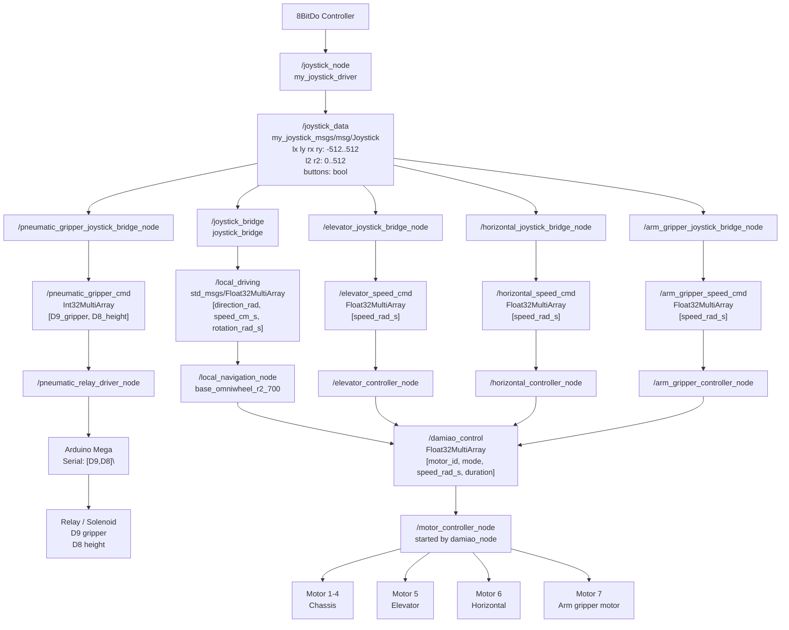
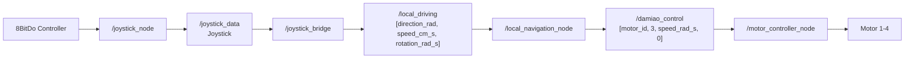
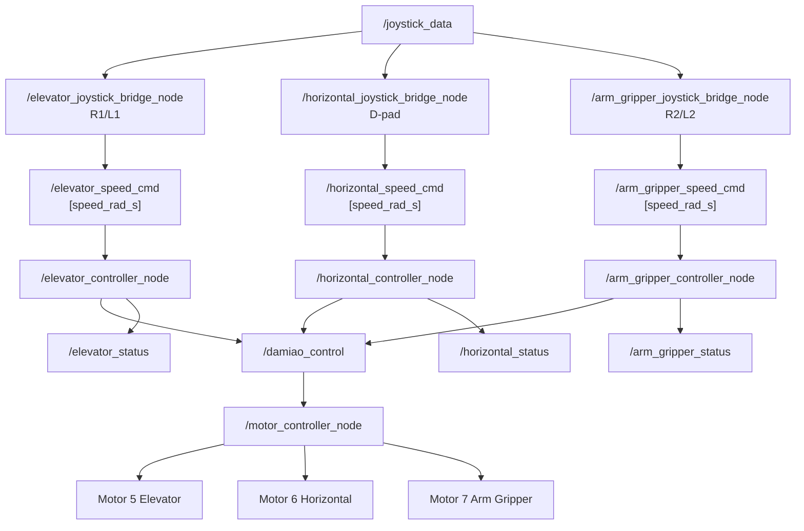
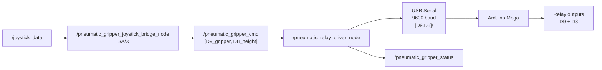
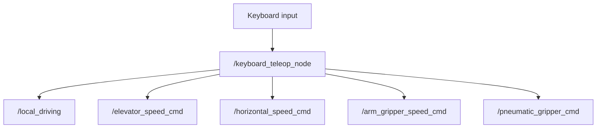
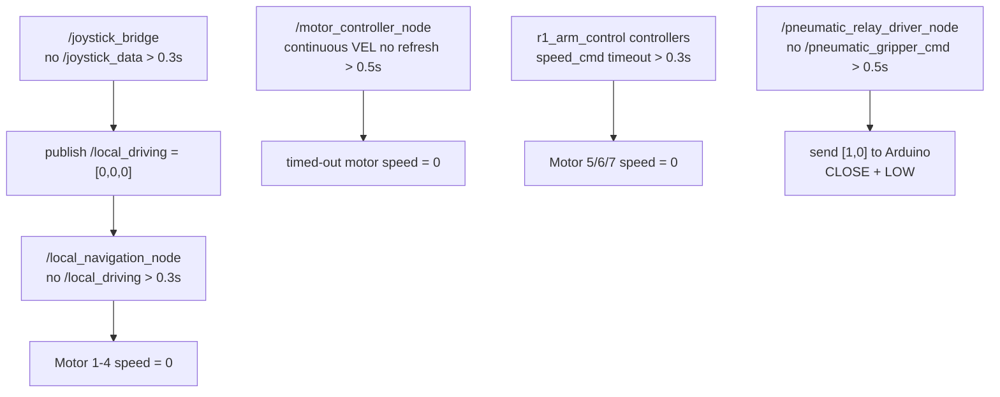

# R1 Node / Topic Graph

本文专门说明当前 R1 ROS 2 系统里各个 node 如何串联、topic 如何传递，以及每个 topic 的数据格式。

## 1. 总览图



## 2. 底盘链路



解释：

```text
/joystick_node:
  读取手柄，发布 /joystick_data

/joystick_bridge:
  把左摇杆/右摇杆转换成底盘移动指令 /local_driving

/local_navigation_node:
  把底盘目标速度转换成 Motor 1-4 的轮速

/motor_controller_node:
  通过 USB-CAN 发送达妙电机命令
```

底盘相关 topic：

| Topic | Type | 数据格式 | 作用 |
|---|---|---|---|
| `/joystick_data` | `my_joystick_msgs/msg/Joystick` | `lx ly rx ry l2 r2 buttons` | 手柄状态 |
| `/local_driving` | `std_msgs/msg/Float32MultiArray` | `[direction_rad, speed_cm_s, rotation_rad_s]` | 底盘目标运动 |
| `/damiao_control` | `std_msgs/msg/Float32MultiArray` | `[motor_id, mode, speed_rad_s, duration]` | 达妙电机命令 |

## 3. 机械臂 Motor 5/6/7 链路



解释：

```text
bridge node:
  只负责把手柄按钮变成 speed_cmd

controller node:
  负责限速、timeout、发布 /damiao_control

/motor_controller_node:
  统一控制 Motor 1-7
```

机械臂相关 topic：

| Topic | Type | 数据格式 | 作用 |
|---|---|---|---|
| `/elevator_speed_cmd` | `Float32MultiArray` | `[speed_rad_s]` | Motor 5 目标速度 |
| `/horizontal_speed_cmd` | `Float32MultiArray` | `[speed_rad_s]` | Motor 6 目标速度 |
| `/arm_gripper_speed_cmd` | `Float32MultiArray` | `[speed_rad_s]` | Motor 7 目标速度 |
| `/elevator_status` | `Float32MultiArray` | `[target_speed, commanded_speed, timeout_active, motor_id]` | Motor 5 状态 |
| `/horizontal_status` | `Float32MultiArray` | `[target_speed, commanded_speed, timeout_active, motor_id]` | Motor 6 状态 |
| `/arm_gripper_status` | `Float32MultiArray` | `[target_speed, commanded_speed, timeout_active, motor_id]` | Motor 7 状态 |

## 4. Pneumatic / Arduino Relay 链路



解释：

```text
/pneumatic_gripper_joystick_bridge_node:
  把 B/A/X 变成 [D9,D8]

/pneumatic_relay_driver_node:
  把 ROS topic [D9,D8] 变成 serial 字符串 "[D9,D8]\n"

Arduino:
  读取 serial 字符串
  parse 两个数字
  digitalWrite 控制 D9 / D8 relay
```

Relay 逻辑：

```text
D9 gripper:
  0 = OPEN
  1 = CLOSE

D8 height:
  0 = LOW
  1 = HIGH
```

常见命令：

| ROS data | Serial to Arduino | 含义 |
|---|---|---|
| `[1,0]` | `[1,0]\n` | CLOSE + LOW |
| `[0,0]` | `[0,0]\n` | OPEN + LOW |
| `[1,1]` | `[1,1]\n` | CLOSE + HIGH |
| `[0,1]` | `[0,1]\n` | OPEN + HIGH |

## 5. Keyboard Teleop 旁路



注意：

```text
keyboard_teleop 不应和 joystick bridge 同时运行。
否则会有两个输入源同时发布相同 command topic。
```

## 6. Safety / Timeout Graph



## 7. Node Summary

| Node | Package | 主要作用 |
|---|---|---|
| `/joystick_node` | `my_joystick_driver` | 读取手柄，发布 `/joystick_data` |
| `/joystick_bridge` | `joystick_bridge` | 手柄摇杆到底盘 `/local_driving` |
| `/local_navigation_node` | `base_omniwheel_r2_700` | 底盘运动学，计算 Motor 1-4 轮速 |
| `/motor_controller_node` | `base_omniwheel_r2_700` | 达妙电机 driver，控制 Motor 1-7 |
| `/elevator_joystick_bridge_node` | `r1_arm_control` | R1/L1 fixed speed -> `/elevator_speed_cmd` |
| `/elevator_controller_node` | `r1_arm_control` | 控制 Motor 5 |
| `/horizontal_joystick_bridge_node` | `r1_arm_control` | D-pad -> `/horizontal_speed_cmd` |
| `/horizontal_controller_node` | `r1_arm_control` | 控制 Motor 6 |
| `/arm_gripper_joystick_bridge_node` | `r1_arm_control` | R2/L2 -> `/arm_gripper_speed_cmd` |
| `/arm_gripper_controller_node` | `r1_arm_control` | 控制 Motor 7 |
| `/pneumatic_gripper_joystick_bridge_node` | `arduino_pneumatic_driver` | B/A/X -> `/pneumatic_gripper_cmd` |
| `/pneumatic_relay_driver_node` | `arduino_pneumatic_driver` | ROS topic -> USB Serial -> Arduino |
| `/keyboard_teleop_node` | `keyboard_teleop` | 键盘调试输入，直接发布 command topics |

## 8. Node Pub/Sub Table

这个表直接说明每个 node 订阅什么、发布什么。

| Node | Subscribe | Publish | 说明 |
|---|---|---|---|
| `/joystick_node` | 无，读取 Linux evdev 硬件输入 | `/joystick_data` | 把手柄输入变成 ROS2 Joystick message |
| `/joystick_bridge` | `/joystick_data` | `/local_driving` | 把左/右摇杆变成底盘目标移动指令 |
| `/local_navigation_node` | `/local_driving` | `/damiao_control` | 把底盘目标移动换算成 Motor 1-4 轮速 |
| `/motor_controller_node` | `/damiao_control` | 无主要控制 topic；直接写 USB-CAN | 达妙电机 driver，控制 Motor 1-7 |
| `/elevator_joystick_bridge_node` | `/joystick_data` | `/elevator_speed_cmd` | R1/L1 转升降速度命令 |
| `/elevator_controller_node` | `/elevator_speed_cmd` | `/damiao_control`, `/elevator_status` | 控制 Motor 5 elevator |
| `/horizontal_joystick_bridge_node` | `/joystick_data` | `/horizontal_speed_cmd` | D-pad 转水平移动速度命令 |
| `/horizontal_controller_node` | `/horizontal_speed_cmd` | `/damiao_control`, `/horizontal_status` | 控制 Motor 6 horizontal |
| `/arm_gripper_joystick_bridge_node` | `/joystick_data` | `/arm_gripper_speed_cmd` | R2/L2 模拟扳机转机械夹爪电机速度命令 |
| `/arm_gripper_controller_node` | `/arm_gripper_speed_cmd` | `/damiao_control`, `/arm_gripper_status` | 控制 Motor 7 arm gripper motor |
| `/pneumatic_gripper_joystick_bridge_node` | `/joystick_data` | `/pneumatic_gripper_cmd` | B/A/X 转 Arduino relay command |
| `/pneumatic_relay_driver_node` | `/pneumatic_gripper_cmd` | `/pneumatic_gripper_status`，并写 USB Serial | 把 ROS command 变成 Arduino serial 字符串 |
| `/keyboard_teleop_node` | 键盘输入 | `/local_driving`, `/elevator_speed_cmd`, `/horizontal_speed_cmd`, `/arm_gripper_speed_cmd`, `/pneumatic_gripper_cmd` | 无手柄时的调试输入源 |

## 9. Topic Publisher / Subscriber Table

这个表从 topic 角度说明：谁发布、谁订阅、数据格式是什么。

| Topic | Type | Publisher | Subscriber | Data |
|---|---|---|---|---|
| `/joystick_data` | `my_joystick_msgs/msg/Joystick` | `/joystick_node` | `/joystick_bridge`, `/elevator_joystick_bridge_node`, `/horizontal_joystick_bridge_node`, `/arm_gripper_joystick_bridge_node`, `/pneumatic_gripper_joystick_bridge_node` | 手柄轴和按键，轴范围 `-512..512` |
| `/local_driving` | `std_msgs/msg/Float32MultiArray` | `/joystick_bridge` 或 `/keyboard_teleop_node` | `/local_navigation_node` | `[direction_rad, speed_cm_s, rotation_rad_s]` |
| `/damiao_control` | `std_msgs/msg/Float32MultiArray` | `/local_navigation_node`, `/elevator_controller_node`, `/horizontal_controller_node`, `/arm_gripper_controller_node` | `/motor_controller_node` | `[motor_id, mode, speed_rad_s, duration]` |
| `/elevator_speed_cmd` | `std_msgs/msg/Float32MultiArray` | `/elevator_joystick_bridge_node` 或 `/keyboard_teleop_node` | `/elevator_controller_node` | `[speed_rad_s]` |
| `/horizontal_speed_cmd` | `std_msgs/msg/Float32MultiArray` | `/horizontal_joystick_bridge_node` 或 `/keyboard_teleop_node` | `/horizontal_controller_node` | `[speed_rad_s]` |
| `/arm_gripper_speed_cmd` | `std_msgs/msg/Float32MultiArray` | `/arm_gripper_joystick_bridge_node` 或 `/keyboard_teleop_node` | `/arm_gripper_controller_node` | `[speed_rad_s]` |
| `/pneumatic_gripper_cmd` | `std_msgs/msg/Int32MultiArray` | `/pneumatic_gripper_joystick_bridge_node` 或 `/keyboard_teleop_node` | `/pneumatic_relay_driver_node` | `[D9_gripper_state, D8_height_state]` |
| `/elevator_status` | `std_msgs/msg/Float32MultiArray` | `/elevator_controller_node` | monitor / debug terminal | `[target_speed, commanded_speed, timeout_active, motor_id]` |
| `/horizontal_status` | `std_msgs/msg/Float32MultiArray` | `/horizontal_controller_node` | monitor / debug terminal | `[target_speed, commanded_speed, timeout_active, motor_id]` |
| `/arm_gripper_status` | `std_msgs/msg/Float32MultiArray` | `/arm_gripper_controller_node` | monitor / debug terminal | `[target_speed, commanded_speed, timeout_active, motor_id]` |
| `/pneumatic_gripper_status` | `std_msgs/msg/String` | `/pneumatic_relay_driver_node` | monitor / debug terminal | human-readable serial/status text |

## 10. Topic Meaning Details

### `/joystick_data`

```text
Publisher:
  /joystick_node

Subscribers:
  /joystick_bridge
  /elevator_joystick_bridge_node
  /horizontal_joystick_bridge_node
  /arm_gripper_joystick_bridge_node
  /pneumatic_gripper_joystick_bridge_node
```

这是所有 controller 输入的源头。底盘、机械臂、气动各自的 bridge node 都从这里读取手柄状态。

### `/local_driving`

```text
Publisher:
  /joystick_bridge
  或 /keyboard_teleop_node

Subscriber:
  /local_navigation_node
```

这是底盘高层移动指令，不是单个轮子的速度。`local_navigation_node` 会把它转换成 Motor 1-4 的 wheel speed。

### `/damiao_control`

```text
Publishers:
  /local_navigation_node
  /elevator_controller_node
  /horizontal_controller_node
  /arm_gripper_controller_node

Subscriber:
  /motor_controller_node
```

这是达妙电机统一底层控制 topic。Motor 1-7 最终都会走这里。

### `/pneumatic_gripper_cmd`

```text
Publisher:
  /pneumatic_gripper_joystick_bridge_node
  或 /keyboard_teleop_node

Subscriber:
  /pneumatic_relay_driver_node
```

这是 Arduino relay 控制 topic。它不会进入 `/damiao_control`，而是由 `pneumatic_relay_driver_node` 转成 USB Serial 字符串发给 Arduino。

## 11. 最重要的理解

```text
手柄输入只产生 /joystick_data。

底盘、机械臂、气动各自有 bridge node 把 /joystick_data 转成自己的 command topic。

达妙 Motor 1-7 最后都汇总到 /damiao_control，由 /motor_controller_node 统一发给电机。

Arduino pneumatic 不经过 /damiao_control。
它走 /pneumatic_gripper_cmd -> serial -> Arduino -> relay。
```

## Domain Isolation

The R1 node graph is only valid after ROS2 domain isolation is applied. The R1 startup script exports:

```bash
ROS_DOMAIN_ID=1
ROS_LOCALHOST_ONLY=1
```

If `/damiao_motor_controller`, `/global_navigation_node`, `/base/dummy_control`, or `/arm/damiao_control` appears on R1, those entries are from another ROS2 graph and must be isolated before testing.

## 2026-06-06 控制输入更新

`/joystick_bridge` 将左摇杆幅度通过 `0.2x + 0.8x³` 映射到 `0..150 cm/s`。START/SELECT 当前不参与底盘调速。
