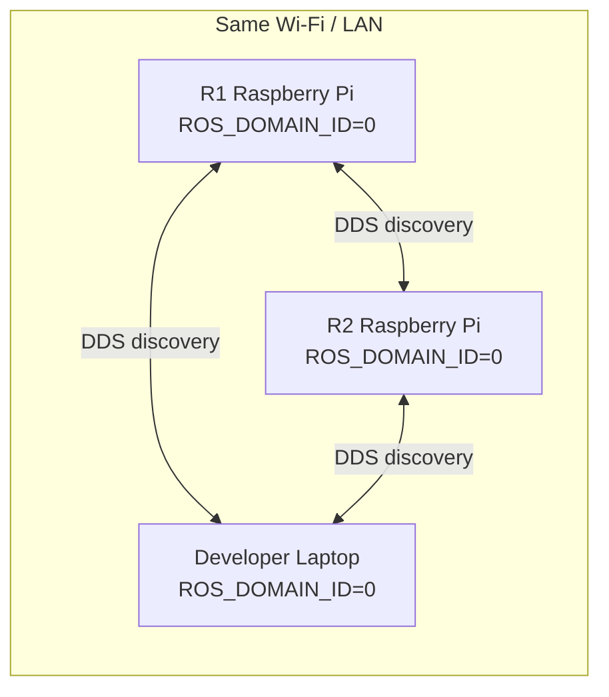
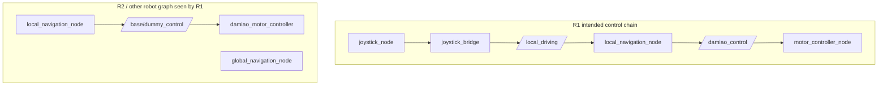
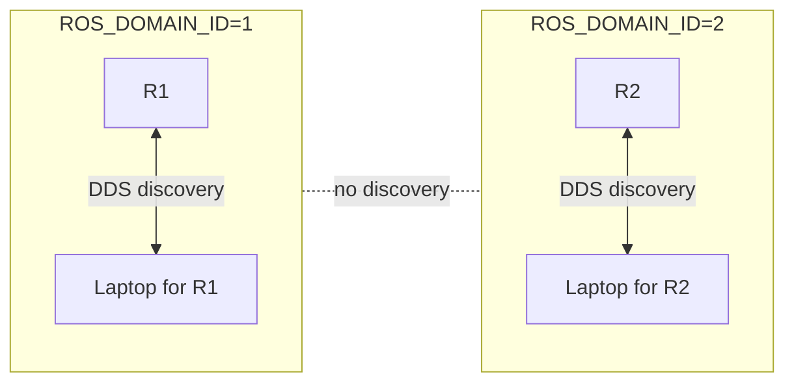

> 2026-06-19 現行操作入口：目前手柄鍵位、STAFF/KFS mode、D-pad 視角、五路 relay 順序請先看 [`CONTROLLER_USAGE.md`](CONTROLLER_USAGE.md)。本文若是舊測試/排查紀錄，內容保留作歷史，不代表目前實機鍵位。

# ROS2 Domain Isolation for R1 / R2

本文档说明为什么 R1 会看到 R2 的 node / topic，为什么这会影响底盘调试，以及以后如何固定避免。

## 1. 问题现象

在 R1 上执行：

```bash
ros2 node list
ros2 topic list
```

曾经看到不属于 R1 当前 workspace 的内容，例如：

```text
/damiao_motor_controller
/global_navigation_node
/arduino_sensor_parser
/base/dummy_control
/arm/damiao_control
```

同时 R1 自己也有：

```text
/motor_controller_node
/local_navigation_node
/joystick_node
/joystick_bridge
/damiao_control
/local_driving
```

这表示 R1 的 ROS2 graph 被 R2 或其它 ROS2 设备污染了。

## 2. 为什么 R1 会看到 R2

ROS2 默认使用 DDS discovery。只要多台电脑满足以下条件，它们会自动互相发现：

- 在同一个网络，例如同一个 Wi-Fi / LAN
- 使用相同 `ROS_DOMAIN_ID`
- 没有限制为 localhost only
- DDS multicast / discovery 没有被网络阻断

也就是说，ROS2 不需要手动输入对方 IP，也可能自动看到对方。



如果 R1 和 R2 都使用默认 `ROS_DOMAIN_ID=0`，R1 上的 `ros2 node list` 就可能显示 R2 的 node。

## 3. 为什么这会影响 chassis

ROS2 topic 按名称匹配。只要 topic 名字和类型相同，publisher / subscriber 就可能连接。

危险情况不是“看得到 node”本身，而是不同机器人之间出现相同或相近的控制 topic。

本次问题中出现了两套控制链：



如果同一个 ROS domain 里有多个相同名字的 node，ROS 会警告：

```text
WARNING: Be aware that there are nodes in the graph that share an exact name
```

这会造成调试判断混乱：

- `ros2 node list` 看到的 node 不一定在本机运行
- `ros2 topic list` 看到的 topic 不一定属于 R1
- `ros2 topic echo` 可能 echo 到别的机器人发布的数据
- 多个同名 node 可能让参数服务、日志和 graph 判断变得不可靠
- 如果 topic 名称重叠，可能出现错误连接或命令互相覆盖

## 4. 如何确认是不是远程 ROS2 node

### 4.1 查看 ROS graph

```bash
ros2 node list
ros2 topic list
```

如果看到 R1 不应该有的 node / topic，例如：

```text
/damiao_motor_controller
/base/dummy_control
/global_navigation_node
```

先不要继续测试底盘。

### 4.2 查看本机真实进程

```bash
pgrep -af 'local_navigation|global_navigation|damiao_motor|arduino_sensor|joystick|damiao|ros2|python'
```

如果 `ros2 node list` 有 node，但 `pgrep` 找不到对应本机进程，通常表示这些 node 来自网络上其它 ROS2 设备。

### 4.3 重启 ROS2 daemon

```bash
ros2 daemon stop
ros2 daemon start
ros2 node list
```

如果 daemon 重启后仍看到那些 node，而本机没有对应进程，基本可以确认是远程 ROS2 graph。

## 5. 临时解决方法

如果只是想立刻隔离 R1 测试，在启动前执行：

```bash
export ROS_DOMAIN_ID=1
export ROS_LOCALHOST_ONLY=1
```

然后启动 R1：

```bash
cd /home/robotics/robocon2026_r1/r1_control_ws
source install/setup.bash
./r1_start_base_1_0.sh
```

检查：

```bash
ros2 node list
ros2 topic list
```

R1 不应该再看到：

```text
/damiao_motor_controller
/global_navigation_node
/base/dummy_control
/arm/damiao_control
```

## 6. 长期解决方案

给每台机器人固定不同的 `ROS_DOMAIN_ID`。

推荐：

```text
R1: ROS_DOMAIN_ID=1
R2: ROS_DOMAIN_ID=2
Developer laptop for R1: ROS_DOMAIN_ID=1
Developer laptop for R2: ROS_DOMAIN_ID=2
```

如果 R1 不需要和其它电脑通信，可以同时启用：

```bash
export ROS_LOCALHOST_ONLY=1
```

如果需要 laptop 远程 echo R1 的 topic，不要用 `ROS_LOCALHOST_ONLY=1`，而是让 laptop 和 R1 使用同一个 `ROS_DOMAIN_ID=1`。



## 7. R1 script setting

R1 启动脚本 `r1_start_base_1_0.sh` 已固定加入：

```bash
export ROS_DOMAIN_ID=1
export ROS_LOCALHOST_ONLY=1
```

这会让从该脚本启动的所有 tmux window 继承同一套 ROS2 隔离环境。

R2 的启动脚本应加入：

```bash
export ROS_DOMAIN_ID=2
```

如果 R2 也只在本机运行，也可以加入：

```bash
export ROS_LOCALHOST_ONLY=1
```

## 8. Before Driving Checklist

每次开车前先检查：

```bash
echo $ROS_DOMAIN_ID
echo $ROS_LOCALHOST_ONLY
ros2 node list
ros2 topic list
```

R1 正常应该只看到 R1 自己的 node / topic。

如果看到以下内容，先停止，不要测试底盘：

```text
/damiao_motor_controller
/global_navigation_node
/base/dummy_control
/arm/damiao_control
```

处理方式：

```bash
ros2 daemon stop
export ROS_DOMAIN_ID=1
export ROS_LOCALHOST_ONLY=1
ros2 daemon start
ros2 node list
```

## 9. 本次事故结论

本次底盘异常排查中，R1 能看到 R2 的 node / topic。恢复旧 git 版本、切换 joystick `128/512`、更换 chassis 后问题仍出现，最后确认 ROS2 graph 中混入了另一套机器人控制链。

因此根因不是单纯 joystick mapping，而是 R1/R2 没有做 ROS2 domain 隔离，导致调试和控制链被其它机器人污染。


## 10. 当前 R1 默认速度配置

当前 R1 不再使用 START/SELECT 速度档位；START/SELECT 只用于 STAFF/KFS mode。source 默认平移和轮速配置为：

```text
joystick_bridge.max_speed_cm = 150.0 cm/s
joystick_bridge.max_rotation = 3.0 rad/s
local_navigation_node.max_wheel_speed_rad_s = 40.0 rad/s
local_navigation_node.max_wheel_accel_rad_s2 = 25.0 rad/s^2
```

旧 `10 -> 20 -> 40 -> 60 -> 100 -> 150 cm/s` 速度档和 `64.0 rad/s` 轮速内容只保留在历史调试记录中，不代表当前实机默认。
