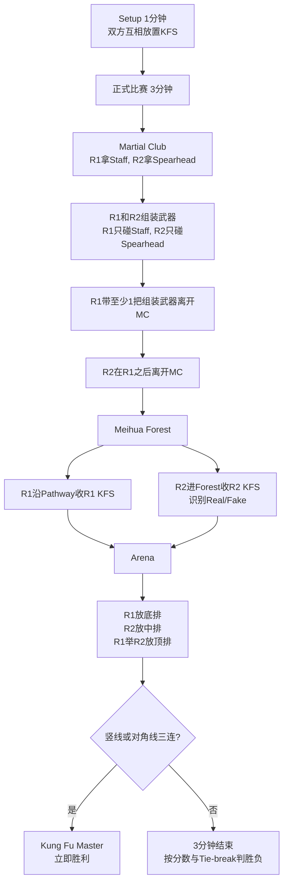
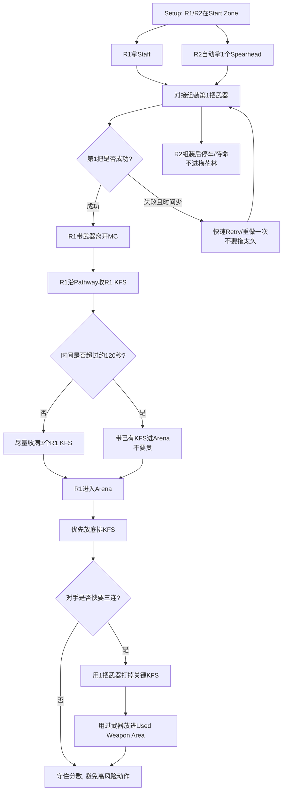
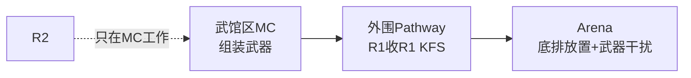
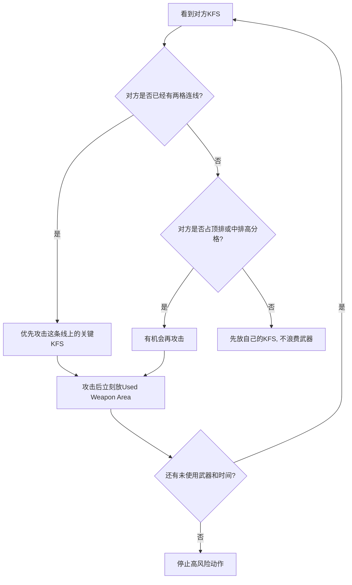
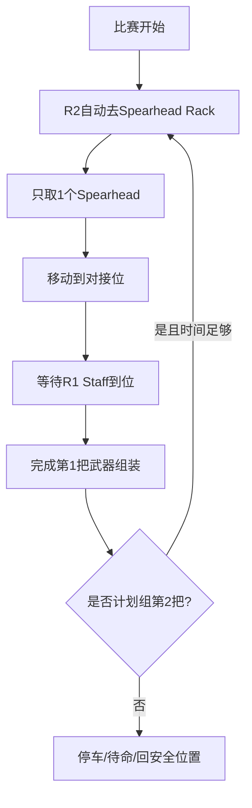
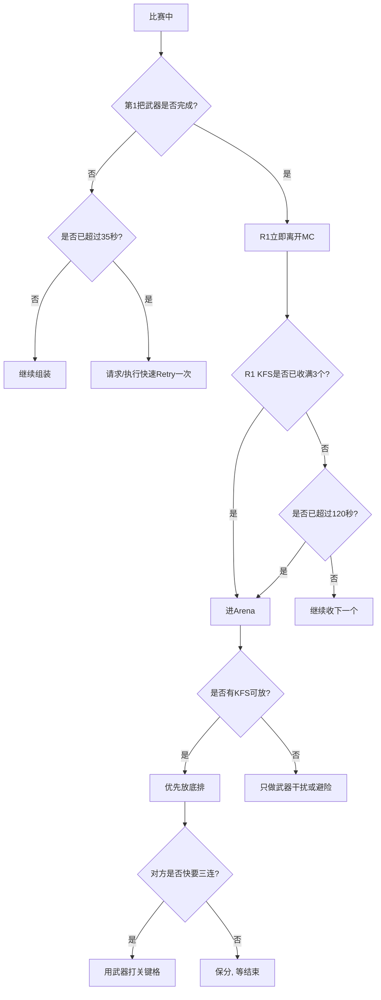

# ABU Robocon 2026《Kung Fu Quest》R1主线详细规则与流程

> 队内使用版。来源：`25-26_rulebook.pdf`。本文件是中文简化与战术整理，不替代官方规则书。重点结合当前方案：**R2 暂不进梅花林，只负责帮助 R1 组装武器；主要靠 R1 得分与破坏对手关键 KFS。**

---

## 0. 先看结论

你们现在的打法可以成立，但它是 **保底打法**，不是完整冲三连打法。

- **R2 不进梅花林**：R2 只做 Spearhead 上料和武器组装。
- **R1 是主力**：拿 Staff、配合组装、收 3 个 R1 KFS、进入 Arena 放底排。
- **武器用途**：不是随便戳，而是用来移除对方井字棋架上的关键 KFS，阻止对方三连。
- **最大目标**：稳定拿 130-160 分左右的基础分，并尽量阻止对手成为 Kung Fu Master。
- **最大弱点**：没有 R2 KFS，基本不能靠自己完成竖线/对角线三连。

---

## 1. 官方完整比赛流程图



---

## 2. 你们当前R1主线流程图



---

## 3. 场地区域与你们要走的路线

```text
[Martial Club]
  R1拿Staff + R2拿Spearhead + 组装武器
       |
       v
[Meihua Forest 外围 Pathway]
  只有R1走外围, 收3个R1 KFS
  R2不要进Forest, 因为omni底盘不适合高度差
       |
       v
[Arena]
  R1放底排KFS
  R1用武器移除对方关键KFS
```

你们当前不依赖 R2 的路线：



---

## 4. R1与R2分工表

| 项目 | R1要做 | R2要做 | 注意事项 |
|---|---|---|---|
| 武馆区 | 拿 Staff | 拿 Spearhead | R1不能碰Spearhead, R2不能碰Staff |
| 武器组装 | 控 Staff 对准 | 控 Spearhead 对准 | 两个机器人本体不要互相接触 |
| 离开武馆 | 必须带至少1把组装武器 | 如果要离开, 必须在R1之后 | 你们方案里R2建议不离开 |
| 梅花林 | R1只走外围Pathway收R1 KFS | 不进Forest | R1不要碰R2 KFS和Fake KFS |
| Arena | 放底排, 使用武器 | 不参与或待命 | R2没R2 KFS不能进Arena放置 |
| 战术目标 | 拿基础分, 破坏对方关键格 | 保障组装成功 | R2越简单越可靠 |

---

## 5. 三分钟时间表: 建议节奏

```mermaid
gantt
    title R1主线打法三分钟时间线
    dateFormat  X
    axisFormat %s秒
    section 前期
    拿Staff/拿Spearhead       :0, 10
    组装第1把武器              :10, 35
    section 中期
    R1离开MC并进入Pathway       :35, 45
    R1收R1 KFS                 :45, 110
    section 后期
    R1进入Arena                :110, 125
    底排放置KFS                :125, 160
    武器干扰/保分              :160, 180
```



更实用的判断线：

| 时间点 | 应该发生什么 | 如果没做到怎么办 |
|---|---|---|
| 0-30秒 | 最好完成第1把武器 | 只Retry一次, 不要无限调 |
| 30-45秒 | R1离开MC | 若还没离开, 放弃多武器, 只求合法出门 |
| 45-110秒 | R1收R1 KFS | 能收几个算几个, 不要为了第3个卡死 |
| 110-125秒 | R1进入Arena | 超过120秒还在Pathway, 直接进Arena |
| 125-160秒 | 底排放置 | 先放稳定的格子, 不追求完美 |
| 160-180秒 | 干扰或保分 | 最后10秒不要做高风险动作 |

---

## 6. 你们可拿分估算

规则分值：武器每把 10 分；KFS带入 Arena 每个 10 分；底排 KFS 每个 30 分；中排 40 分；顶排 80 分。

### R1-only保底分

| 完成情况 | 分数 |
|---|---:|
| 1把武器 + 1个R1 KFS带入 + 1个底排 | 10 + 10 + 30 = 50 |
| 1把武器 + 2个R1 KFS带入 + 2个底排 | 10 + 20 + 60 = 90 |
| 1把武器 + 3个R1 KFS带入 + 3个底排 | 10 + 30 + 90 = 130 |
| 2把武器 + 3个R1 KFS带入 + 3个底排 | 20 + 30 + 90 = 140 |
| 3把武器 + 3个R1 KFS带入 + 3个底排 | 30 + 30 + 90 = 150 |
| 4把武器 + 3个R1 KFS带入 + 3个底排 | 40 + 30 + 90 = 160 |

### 这套打法的现实定位

- **130分**：应该作为稳定目标。
- **140-160分**：需要组装更快, 且R1收放KFS非常稳。
- **Kung Fu Master**：只靠R1底排基本很难达成, 主要靠阻止对手三连。

---

## 7. 武器到底怎么用

规则允许 R1 在 Arena 中使用组装武器尝试移除对手占在 Tic-Tac-Toe Rack 上的 KFS。这里的关键词是 **组装武器** 和 **一次性**。

### 武器使用决策图



### 武器使用规则雷区

| 雷区 | 后果/风险 | 正确做法 |
|---|---|---|
| 用R1本体撞对方KFS | 规则写的是用assembled weapon, 有争议或违规风险 | 只用组装好的武器接触 |
| 一把武器连续打多个KFS | 违规风险 | 每把武器只用一次 |
| 武器碰到自己KFS | 也可能算用过 | 操作时避开自己KFS |
| 用过武器不放Used Weapon Area | 后续再碰KFS会违规 | 攻击后先丢到Used Weapon Area |
| 武器拆开了继续用 | 不允许 | 拆开的武器不能用 |
| 为了攻击错过自己放置 | 亏分 | 先放己方KFS, 再干扰 |

---

## 8. R2只组装时的详细注意事项

R2虽然不进梅花林, 但它仍然要遵守自动机器人规则。比赛开始后, R2不应由人手动发命令完成任务。

### R2推荐流程



### R2停车位置建议

- 不要挡住 R1 离开 MC 的路线。
- 不要停在 Staff Rack 或 Spearhead Rack 正前方, 避免R1再取物时卡住。
- 不要靠近场地边缘, 避免被判掉落或误碰。
- 程序上设置“组装结束状态”, 避免R2继续乱动。

### R2不要做的事情

- 不要进入 Meihua Forest, 除非底盘已经能稳定处理 200/400/600 mm 高度差。
- 不要碰 Staff。
- 不要一次拿多个 Spearhead。
- 不要在没有完成当前 Spearhead 组装前去拿下一个。
- 不要比赛开始后靠人工遥控完成任务。

---

## 9. R1机械与控制建议

R1是主力, 不是只要跑得快就行。最重要的是 **快、稳、准、不掉东西**。

### 底盘速度建议

| 模式 | 用途 | 建议速度感受 |
|---|---|---|
| 快速档 | 区域间移动, Pathway赶路 | 快但不能甩尾, 操作员能稳定刹住 |
| 精准档 | 拿Staff, 对接, 抓KFS, 放KFS | 慢且细腻, 摇杆小动作可控 |
| 攻击档 | 用武器碰对方KFS | 速度可控, 不要一冲过头 |

### 代码/控制建议

- 做摇杆平滑或加速度限制, 防止起步太猛把KFS甩掉。
- 做低速精准模式按钮, 对接和放置时切低速。
- 加刹车/姿态保持逻辑, 到位后不要滑。
- 关键机构设置限位开关或软限位, 避免撞坏场地。
- 给驾驶员清晰反馈: 当前是否夹住Staff/KFS、武器是否已使用。

### 机构建议

| 任务 | 机构重点 |
|---|---|
| 拿Staff | 导向口要大, 允许误差, 不要必须毫米级对准 |
| 组装武器 | Staff端和Spearhead端最好有漏斗/锥形导向 |
| 收R1 KFS | 夹爪接触面积要大, 350mm纸箱不要用小点夹 |
| 放底排 | 释放动作要稳定, 不要把KFS弹出去 |
| 武器攻击 | 武器固定要可靠, 但用完后能快速丢入Used Weapon Area |

---

## 10. Setup阶段要做什么

Setup只有1分钟。双方会互相放置对方KFS。

### 对手放你们的KFS

| KFS类型 | 数量 | 位置规则 |
|---|---:|---|
| R1 KFS | 3 | 放在Forest边界且靠近R1 Pathway的块上 |
| R2 Real KFS | 4 | 放在Forest内空位 |
| Fake KFS | 1 | 放在Forest内空位, 但不能放1/2/3入口块 |

你们当前 R1-only 策略只重点关注 **3个R1 KFS**。练习时必须模拟对手把它们放在最难拿的位置。

### 你们放对手的KFS

合法前提下, 可以让对方更难：

- 把对方 R1 KFS 放在离其最佳路线更远或角度更难抓的位置。
- 对方如果R2强, 把R2 Real KFS放成需要更多转向/路径判断的位置。
- Fake KFS不能放入口1/2/3, 不要违规。
- 所有KFS都要放在350mm标记范围内, 空白面朝下。

---

## 11. 违规与Retry重点

### 你们最容易踩的违规

| 场景 | 风险 |
|---|---|
| R1没带组装武器就离开MC | 强制Retry |
| R2先于R1离开MC | 强制Retry |
| R1碰Spearhead | 强制Retry |
| R2碰Staff | 强制Retry |
| R1在Arena外碰R2 KFS/Fake KFS | 强制Retry |
| 用同一把武器攻击多次 | 强制Retry |
| 用过武器未放Used Weapon Area就继续碰KFS | 强制Retry |
| 机器人掉出梅花林或Arena | 强制Retry |
| 未经裁判允许队员摸机器人 | 强制Retry |

### Retry原则

- Retry次数不限, 但 **比赛时间不停**。
- Retry时可以调整机器人手上持有的KFS、Staff、Spearhead、武器。
- 不可以调整场地上其他没有被机器人持有的物品。
- 练习时要专门练“Retry后10秒内恢复运行”。

---

## 12. R1-only战术决策树



---

## 13. 训练计划建议

| 训练项目 | 目标标准 |
|---|---|
| R1拿Staff | 连续10次成功, 每次不超过5秒 |
| R2拿Spearhead | 连续10次成功, 不碰Staff/场地 |
| 第1把武器组装 | 连续5次在30秒内完成 |
| R1收单个KFS | 每个位置都能稳定抓取 |
| R1收3个KFS | 从离开MC到收完不超过70秒 |
| R1底排放置 | 连续9次放置成功, 不掉出槽位 |
| 武器攻击 | 能打掉指定关键格, 且不碰自己KFS |
| 用过武器处理 | 攻击后5秒内放进Used Weapon Area |
| Retry恢复 | 任意阶段Retry后10-15秒恢复动作 |

---

## 14. 比赛前检查清单

### 机械检查

- [ ] R1夹Staff稳定。
- [ ] R1夹KFS不会滑。
- [ ] R1放KFS不会卡住。
- [ ] 武器连接不会行驶中松脱。
- [ ] 武器使用后能快速放进Used Weapon Area。
- [ ] R2取Spearhead机构不会碰到Staff。
- [ ] R2停车后不挡R1路线。

### 电控与软件检查

- [ ] 急停按钮明显且可用。
- [ ] R1高速/低速档切换正常。
- [ ] R1摇杆不会突然暴冲。
- [ ] R2启动后自动执行流程。
- [ ] R2任务完成后进入安全待命状态。
- [ ] 电池电压符合限制。
- [ ] 所有线缆固定, 不会被武器或KFS挂住。

### 规则检查

- [ ] R1离开MC时一定带组装武器。
- [ ] R2不比R1先离开MC。
- [ ] R1不碰Spearhead。
- [ ] R2不碰Staff。
- [ ] R1在Arena外不碰R2 KFS和Fake KFS。
- [ ] 每把武器只用一次。
- [ ] 用过武器先放Used Weapon Area。

---

## 15. 队内最简口令版

> **先组一把, R1合法出门。R2只拿头, 不进林。R1收自己的三个KFS, 进Arena先放底排。武器别乱用, 留着打对方三连关键格。最后10秒保分, 不冒险。**

maintainer: Hero@EdUHK robotics team 2026 | github: herolch07
